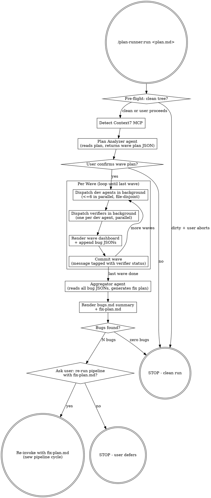

# Consolidated Spec: plan-runner

Generated by jupiter:rewrite on 2026-04-20T05:05:23Z.
Source files are listed in the order shown below; originals preserved unless you chose cleanup at the end of this run.

<!-- source: plugins/plan-runner/README.md -->
## README

## plan-runner


Take a free-form Markdown implementation plan and execute it through a parallel agent swarm with built-in verification and bug-driven re-planning.

### What it does

1. **Analyze.** A `plan-analyzer` agent reads your plan and buckets tasks into waves of file-disjoint work (max 6 agents per wave, ordered as a DAG).
2. **Confirm.** You see the wave plan and approve before any dev work runs.
3. **Execute per wave.** For each wave: dispatch up to 6 `plan-dev` agents in parallel, then dispatch one `plan-verifier` per dev agent in parallel, then commit the wave with verifier status in the message.
4. **Aggregate.** A `plan-aggregator` agent collects every verifier-flagged bug, deduplicates, ranks by severity (P0-P3), and writes both a `bugs.md` audit and a `fix-plan.md` (a new plan ready for re-runs).
5. **Re-run prompt.** You decide whether to auto-handoff to a fresh-context subagent that runs `/plan-runner:run <fix-plan.md>` for cycle 2.

### Install

```bash
claude plugin marketplace add MisterVitoPro/qa-swarm --plugin plan-runner
```

### Usage

```bash
/plan-runner:run docs/foo/feature-plan.md
```

The plan can be any Markdown file with task content. There is no required schema -- the analyzer reads it heuristically.

### Output

Per cycle, output lives at:

```
docs/plan-runner/{DATE}/cycle-{N}/
  wave-plan.json         # analyzer output
  bugs/
    wave-W-agent-A.json  # one per verifier
  bugs.md                # aggregator's human-readable summary
  fix-plan.md            # aggregator's next-cycle input
  manifest.json          # pipeline metadata
```

### Requirements

- Clean working tree (you can override, but commits are per-wave)
- Optional: Context7 MCP server for current framework docs (auto-detected; skipped if absent)

### Auto-Setup

On first session start, a hook automatically adds `docs/plan-runner/` to `.gitignore` (if a `.gitignore` exists). Generated output is not committed and remains local to the working tree.

### Design

Full design spec at `docs/superpowers/specs/2026-04-15-plan-runner-design.md` (in the source repo).

### License

MIT

<!-- source: plugins/plan-runner/docs/superpowers/specs/2026-04-15-plan-runner-design.md -->
## 2026-04-15-plan-runner-design

## plan-runner — Design Spec

**Date:** 2026-04-15
**Status:** Design approved, awaiting implementation plan
**Plugin name:** `plan-runner`
**Plugin location:** `plugins/plan-runner/`

### What it is

A Claude Code plugin that takes a free-form Markdown implementation plan and executes it through a parallel agent swarm with built-in verification and bug-driven re-planning. Each cycle: an analyzer agent buckets the plan into waves of file-disjoint tasks, dev agents implement in parallel, verifier agents check each implementation against the plan, an aggregator collects all bugs and generates a fix-plan, and the user decides whether to run the pipeline again with the fix-plan as the new input.

### High-level flow



### Locked-in design decisions

| # | Decision | Rationale |
|---|----------|-----------|
| 1 | Input is **free-form Markdown plan file** (any structure, any source) | User wants to point at any plan they have, not be locked to writing-plans output |
| 2 | **DAG of waves, file-disjoint within wave, max 6 agents per wave** | Respects task ordering AND avoids write conflicts. Wave structure also gives natural status checkpoint |
| 3 | **Per-wave batched verification** (devs all finish -> verifiers all run -> next wave) | Wave is already a sync point. Devs in wave N work against verified code from wave N-1 |
| 4 | **Single working tree, per-wave commits** with verifier-status tag in commit message | File-disjoint constraint already prevents conflicts; worktrees would buy isolation we don't need. Per-wave commits give natural recovery points without per-agent commit noise |
| 5 | **Per-verifier JSON files + aggregator-rendered Markdown summary** | Clean machine input for aggregator (no parsing fragility, no concurrent-write contention) + human-readable output |
| 6 | **Three-layer status reporting**: per-agent return status, per-wave dashboard, Claude Tasks. Agents dispatched with `run_in_background: true` | Layers reinforce each other. Background mode lets orchestrator do bookkeeping (Task updates, next-wave prep) while agents run |
| 7 | **Dedicated `plan-analyzer` agent** (not inline in orchestrator) | Plan analysis is a one-shot reasoning task; isolating it preserves the orchestrator's context for the long coordination loop |
| 8 | **One full pipeline pass, then user-gated re-run with fix-plan.md** as new input. No automatic loop cap. | User decides each cycle. Cycle counter in prompts so user can spot non-convergence |
| 9 | **Context7 MCP detected once at startup**, passed as flag to dev agents only | Verifiers and aggregator review against the plan, not against current docs. Skip Context7 entirely if not detected |

### Plugin layout

```
plugins/plan-runner/
  .claude-plugin/
    plugin.json              # name, version, keywords
  agents/
    plan-analyzer.md         # 1x: parses plan, returns wave plan JSON
    plan-dev.md              # generic dev agent (parameterized per task)
    plan-verifier.md         # generic verifier (parameterized per dev task)
    plan-aggregator.md       # 1x: collects bug JSONs, generates fix plan
  skills/
    run/
      SKILL.md               # orchestrator entry point
  test-fixtures/
    tiny.md
    medium.md
    pathological.md
  README.md
  LICENSE
```

### Agent roster

| Agent | Count per pipeline | Model | Job |
|-------|--------------------|-------|-----|
| `plan-analyzer` | 1 | sonnet | Reads plan.md, returns wave plan JSON: waves, agents-per-wave, file ownership per agent, recommended dev model per task |
| `plan-dev` | up to 6 per wave (variable across waves) | sonnet (default), opus if analyzer flags task as complex | Implements assigned tasks, writes only assigned files, uses Context7 if available |
| `plan-verifier` | one per dev agent that ran | sonnet | Reads dev agent's task spec + the files dev was assigned + the actual diff for those files; reports each acceptance-criteria gap as a bug JSON |
| `plan-aggregator` | 1 per pipeline | sonnet | Reads all bug JSONs, dedups, ranks (P0-P3), produces `bugs.md` summary + `fix-plan.md` (a new plan ready for re-runs) |

Total agents per pipeline: `1 + N(devs) + N(verifiers) + 1` where N(devs) = N(verifiers) = sum across waves, capped at 6 concurrent.

### Why these four agents (and not more)

- **No separate orchestrator agent.** The skill itself is the orchestrator (matches qa-swarm pattern). Skills are the controller, agents are the workers.
- **No separate commit agent.** The orchestrator runs `git add -A && git commit` directly between waves.
- **Dev and verifier are generic, parameterized.** Same definition file, different prompt context per invocation. Avoids agent sprawl.
- **Plan-analyzer and aggregator are distinct** even though both do planning work. Different inputs, outputs, and timing. Forcing them into one would muddle the prompt.

### Output directory

```
docs/plan-runner/{DATE}/{cycle-N}/
  wave-plan.json             # plan-analyzer output (consumed by orchestrator)
  bugs/
    wave-{W}-agent-{A}.json  # one per verifier
  bugs.md                    # human-readable summary (rendered by aggregator)
  fix-plan.md                # next-cycle input (rendered by aggregator)
  manifest.json              # pipeline metadata: input plan, waves, durations, statuses
```

**Cycle numbering:** at startup, orchestrator scans `docs/plan-runner/{DATE}/` for existing `cycle-*` directories and uses the next integer (no existing cycles -> `cycle-1`, `cycle-1` exists -> `cycle-2`, etc). This works for both fresh runs and accepted re-runs without the user needing to specify a cycle number.

### Key file schemas

#### `wave-plan.json` (analyzer -> orchestrator)

```json
{
  "source_plan": "docs/foo/feature.md",
  "context7_available": true,
  "waves": [
    {
      "wave_id": 1,
      "rationale": "Foundational schema + types -- nothing depends on prior waves",
      "agents": [
        {
          "agent_id": "wave-1-agent-1",
          "task_title": "Add User and Session DB models",
          "task_excerpt": "verbatim Markdown excerpt from the plan",
          "owned_files": ["src/models/user.ts", "src/models/session.ts"],
          "acceptance_criteria": ["User has email/passwordHash/createdAt", "Session FK to User"],
          "recommended_model": "sonnet",
          "complexity_signals": ["isolated, 2 files, clear spec"]
        }
      ]
    }
  ],
  "uncovered_plan_sections": ["section title or 'none'"]
}
```

`uncovered_plan_sections` lets the analyzer flag any plan content it could not bucket so the orchestrator can warn the user before confirming the wave plan.

#### Dev agent return JSON

```json
{
  "agent_id": "wave-1-agent-1",
  "status": "DONE | DONE_WITH_CONCERNS | BLOCKED | NEEDS_CONTEXT",
  "files_written": ["src/models/user.ts", "src/models/session.ts"],
  "files_unexpectedly_modified": [],
  "context7_queries": [{"library": "drizzle-orm", "purpose": "verify pgTable API"}],
  "summary": "two-sentence what-I-did",
  "concerns": ["optional: notes for verifier or user"]
}
```

`files_unexpectedly_modified`: if the dev agent had to touch a file outside `owned_files`, it gets logged here for the verifier to scrutinize.

#### Verifier bug JSON (`wave-{W}-agent-{A}.json`)

```json
{
  "agent_id": "wave-1-agent-1",
  "task_title": "Add User and Session DB models",
  "verifier_status": "CLEAN | BUGS_FOUND | UNVERIFIABLE",
  "bugs": [
    {
      "bug_id": "wave-1-agent-1-bug-1",
      "severity": "P0 | P1 | P2 | P3",
      "category": "missing_requirement | incorrect_implementation | scope_drift | broken_existing",
      "title": "Session model missing FK constraint to User",
      "file": "src/models/session.ts",
      "line": 12,
      "evidence": "verbatim code snippet",
      "expected": "FK constraint on userId per acceptance criteria 2",
      "suggested_fix": "Add `references(() => users.id)` to userId column"
    }
  ]
}
```

If `verifier_status: CLEAN`, `bugs: []`. The aggregator only consumes files where bugs exist.

#### `bugs.md` (aggregator -> user)

Markdown table grouped by wave then severity, with full bug details below. Same shape as `qa-swarm` report. Purpose: skim-able audit of what went wrong.

#### `fix-plan.md` (aggregator -> next pipeline cycle)

A new free-form Markdown plan in the same style as the original input. Each section is a fix task with:
- Title (e.g., "Fix: Session model missing FK constraint")
- File(s) to modify
- Acceptance criteria (the bug's `expected` field becomes the criterion)
- References back to the originating bug ID

Crucially: this file is **valid input to `/plan-runner:run`** itself. The next cycle just feeds it back through the same analyzer -> wave -> verify pipeline.

#### `manifest.json` (orchestrator-maintained)

```json
{
  "cycle": 1,
  "input_plan": "docs/foo/feature.md",
  "started_at": "2026-04-15T14:00:00Z",
  "completed_at": "2026-04-15T14:23:11Z",
  "context7_available": true,
  "waves": [
    {
      "wave_id": 1,
      "duration_seconds": 142,
      "agents": [
        { "agent_id": "wave-1-agent-1", "dev_status": "DONE", "verifier_status": "CLEAN", "bug_count": 0 }
      ],
      "commit_sha": "abc123..."
    }
  ],
  "total_bugs": 3,
  "next_cycle_plan": "docs/plan-runner/2026-04-15/cycle-1/fix-plan.md"
}
```

### Data flow summary

```
plan.md
   v (analyzer)
wave-plan.json
   v (orchestrator dispatches per wave)
wave-1: [dev JSON + verifier JSON] x N agents
   v commit wave 1
wave-2: [dev JSON + verifier JSON] x N agents
   v commit wave 2
...
   v (aggregator reads all bug JSONs)
bugs.md + fix-plan.md
   v (user prompt)
   +-- "yes" -> /plan-runner:run docs/.../cycle-1/fix-plan.md  (becomes cycle-2)
   +-- "no"  -> STOP
```

### Error handling

#### Pre-flight failures (before any agents dispatch)

| Condition | Behavior |
|---|---|
| Plan file doesn't exist | Print `Error: <path> not found.` Suggest example. STOP. |
| Plan file is empty / no extractable tasks | Run analyzer; if it returns zero waves, print `No actionable tasks found in plan.` STOP. |
| Working tree dirty | Print warning + uncommitted-files list. Prompt `Continue anyway? (Y/n)`. Default n. Same pattern as `qa-swarm:implement`. |
| Context7 not detected | Log `Context7 MCP not detected -- dev agents will rely on training data only.` Continue. |

#### Plan-analyzer guardrails

The analyzer's output is untrusted machine input. Orchestrator validates before dispatching anything:

| Validation | Action on failure |
|---|---|
| `waves[*].agents.length <= 6` | Reject. Re-prompt analyzer: "Wave {W} has {N} agents, max is 6. Re-bucket." |
| File ownership disjoint within wave | Reject. Re-prompt with the conflict and: "Tasks {A} and {B} both claim {file}. Re-partition." |
| `uncovered_plan_sections` non-empty | Surface to user during wave-plan confirmation: `Analyzer couldn't bucket: {sections}. Continue / abort / re-analyze?` |
| Analyzer crashes / returns malformed JSON | One retry with explicit "return valid JSON matching this schema". Second failure -> STOP, print analyzer's raw output for debugging. |

#### User confirmation gate (after analyzer)

Before dispatching any dev work, orchestrator prints the wave plan for approval:

```
Wave Plan (3 waves, 8 dev agents total)
========================================
Wave 1 (3 agents, ~parallel):
  agent-1: Add User and Session DB models       -> src/models/{user,session}.ts
  agent-2: Add migration runner                  -> src/db/migrate.ts
  agent-3: Define auth types                     -> src/types/auth.ts
Wave 2 (4 agents, ~parallel):
  ...
Wave 3 (1 agent):
  ...

Uncovered plan sections: none
Proceed? (Y/n)
```

If `n`, STOP. If `Y`, begin Wave 1.

#### In-flight failures (during a wave)

| Status returned by dev agent | Orchestrator response |
|---|---|
| `DONE` | Proceed to verifier. |
| `DONE_WITH_CONCERNS` | Pass concerns to verifier as extra inspection focus. Proceed. |
| `NEEDS_CONTEXT` | Treat as a bug: synthesize a P1 bug entry ("dev agent blocked: needed X"), continue with whatever was written, let aggregator queue it for cycle 2. |
| `BLOCKED` (couldn't start) | Synthesize a P0 bug entry, mark dashboard cell `BLOCKED`, continue wave. Don't retry inline -- the aggregator's fix-plan will address it next cycle. |
| Tool error / agent crash | Log to `manifest.json`. Treat the same as BLOCKED. Continue wave. |
| Dev agent wrote to files outside `owned_files` | Verifier inspects them with extra scrutiny; aggregator flags as `category: scope_drift`. |

| Status returned by verifier | Orchestrator response |
|---|---|
| `CLEAN` | Bug JSON has empty `bugs[]`, dashboard shows clean. |
| `BUGS_FOUND` | Write bug JSON to `bugs/wave-W-agent-A.json`. Dashboard shows bug count. |
| `UNVERIFIABLE` (e.g., couldn't read files) | Synthesize a P2 bug "verification failed: {reason}". Continue. |
| Verifier crash | Synthesize a P2 bug "verifier crashed". Continue. |

**Key principle: no inline retries within a pipeline run.** Bugs are aggregated, fix-plan is generated, user decides whether to start cycle 2. Don't burn the user's time looping mid-pipeline.

#### Wave commit failures

| Condition | Behavior |
|---|---|
| Nothing to commit (all dev agents BLOCKED) | Skip commit. Note in `manifest.json`: `"commit_sha": null, "skipped_reason": "no changes"`. Continue. |
| Pre-commit hook fails | Print hook output. Prompt `Continue without committing this wave? (Y/n)`. If Y, leave wave uncommitted, continue (subsequent wave commits will include it). If n, STOP. |
| Other git failure | Print error. STOP. |

#### End-of-pipeline edge cases

| Condition | Behavior |
|---|---|
| Zero bugs found across all waves | Print success summary. Skip aggregator. Skip the re-run prompt. STOP. |
| Aggregator crashes | Bug JSONs are intact on disk. Print `Aggregator failed -- bug JSONs saved at {path}, run aggregation manually.` STOP. |
| All bugs are P3 only | Aggregator generates fix-plan, user prompt adds a hint: `(All N bugs are P3 / low priority -- re-running is optional.)` |
| User declines re-run | Print `Stopping. Bugs and fix-plan saved at {path}. Re-run later with /plan-runner:run {fix-plan path}.` |
| User accepts re-run | Auto-handoff to a fresh-context subagent that invokes `/plan-runner:run {fix-plan path}`. Same pattern as `qa-swarm:attack` Step 6 -- preserves user attention without polluting the orchestrator's context with a second cycle's state. |

#### Re-run convergence (no hard cap)

No automatic cap on cycles. User decides each time. Two safety nets so we don't silently spin:

1. **Cycle counter visible.** Prompt at end of cycle 2 includes: `(This was cycle 2. Cycle 1 had X bugs, this cycle has Y.)` -- user can see if it's converging or oscillating.
2. **Per-cycle output is cumulative.** `cycle-1/`, `cycle-2/`, `cycle-3/` directories preserve full history. User can diff bugs.md across cycles to spot recurring failures.

If user wants automation, they can wrap `/plan-runner:run` in `/loop`. We don't bake a cap into the plugin.

#### Mid-pipeline interruption (Ctrl-C / session ends)

- Bug JSONs and `manifest.json` are written incrementally as each wave completes -- partial state survives.
- Per-wave commits preserve completed work in git.
- No resume-from-partial-state command in v1 (YAGNI). User re-runs from start with the same plan; analyzer re-buckets and re-dispatches. Already-committed work is just re-touched (or not, if the dev agent finds no diff to make).

### Testing & validation strategy

This is a metadata-driven plugin (Markdown agent definitions + JSON contracts + a skill that orchestrates LLM calls). There is no compiled code or unit-testable logic. "Testing" here means three things:

#### 1. Static validation (cheap, automatable)

| What | How |
|---|---|
| Plugin manifest valid | Match Claude Code plugin schema. Verify `plugin.json` keys, agent files exist where referenced, skill `SKILL.md` has required frontmatter. |
| JSON schemas for agent outputs | Write JSON Schema files for `wave-plan.json`, dev return JSON, verifier bug JSON, `manifest.json`. Orchestrator validates analyzer output before dispatching. |
| Markdown agent files have required frontmatter | Each agent has `name`, `description`, `model`, `color`. Sanity-check during plugin install. |

#### 2. Reference plans (manual smoke tests)

Ship 2-3 reference plans in `plugins/plan-runner/test-fixtures/` for manual verification:

| Fixture | Purpose | Expected wave shape |
|---|---|---|
| `tiny.md` -- single isolated task | Verify minimal path (1 wave, 1 dev, 1 verifier, no bugs) | 1 wave x 1 agent |
| `medium.md` -- 5 tasks, some sequential, some parallel | Verify analyzer correctly identifies the DAG and bucketing | 2-3 waves x 2-4 agents |
| `pathological.md` -- 10 tasks where 8 touch the same core file | Verify file-disjoint constraint forces sequential waves rather than parallel | 5+ waves x 1-2 agents |

These are inspection harnesses, not automated tests. Run the plugin on a fixture, eyeball the wave-plan, run the pipeline against a throwaway repo, inspect the bug JSONs and rendered Markdown.

#### 3. Behavioral assertions (covered by orchestrator's own validation)

Because the orchestrator validates analyzer output against schema and against the disjoint-files invariant before dispatching, several "tests" are baked into runtime:

- Cannot dispatch a wave with >6 agents (validation rejects, re-prompts analyzer).
- Cannot dispatch a wave with overlapping file ownership (same).
- Cannot proceed to wave N+1 with unverified wave N (sequential structure forces it).
- Cannot skip the user-confirmation gate (orchestrator blocks on input).

These are structural guarantees, not test assertions, but they cover the failure modes that would matter most.

#### What we are explicitly NOT testing

- **Agent prompt quality.** Whether the dev agent writes good code or the verifier catches real bugs is judged by running the plugin on real plans, not by automated tests. Like all LLM-driven tooling, this is operator-validated, not unit-tested.
- **End-to-end automation.** We are not setting up a CI harness that runs full pipelines on fixture repos. The reference plans above are for the maintainer to spot-check, not for CI.

### Out of scope for v1

- Resume-from-partial-state command
- Multi-repo / monorepo task fanout
- Replacing the analyzer's wave plan via user edit before confirmation (right now: accept or abort; could add "edit" later)
- Cycle convergence detection (e.g., warn if same bug reappears across cycles)
- Worktree-based isolation (file-disjoint constraint within waves makes this unnecessary at v1 scope)

### Marketplace registration

After implementation, add to `.claude-plugin/marketplace.json`:

```json
{
  "name": "plan-runner",
  "source": "./plugins/plan-runner",
  "category": "development"
}
```

And follow versioning convention: tag releases as `plan-runner/v<version>`.

<!-- source: plugins/plan-runner/docs/superpowers/plans/2026-04-15-plan-runner.md -->
## 2026-04-15-plan-runner

## plan-runner Implementation Plan

> **For agentic workers:** REQUIRED SUB-SKILL: Use superpowers:subagent-driven-development (recommended) or superpowers:executing-plans to implement this plan task-by-task. Steps use checkbox (`- [ ]`) syntax for tracking.

**Goal:** Build a Claude Code plugin (`plan-runner`) that takes a free-form Markdown implementation plan, breaks it into file-disjoint waves of <=6 parallel agents, dispatches dev + verifier agents per wave with per-wave commits, then aggregates verifier-flagged bugs into a fix-plan and asks the user whether to re-run the pipeline with that fix-plan.

**Architecture:** Metadata-driven plugin (no compiled code). Four agent definitions (analyzer, dev, verifier, aggregator) plus one orchestrator skill. Agents return structured JSON; orchestrator validates against JSON schemas before dispatching. Output lives under `docs/plan-runner/{DATE}/cycle-N/`.

**Tech Stack:** Markdown (agent + skill definitions), JSON (manifests, schemas, contracts), Bash (orchestrator git operations + Context7 detection). Same structural pattern as the existing `qa-swarm` plugin.

**Spec reference:** `docs/superpowers/specs/2026-04-15-plan-runner-design.md`

---

### File Structure

**New files (14):**
```
plugins/plan-runner/
  .claude-plugin/plugin.json                  # plugin manifest
  agents/plan-analyzer.md                     # bucket plan into waves
  agents/plan-dev.md                          # generic dev agent template
  agents/plan-verifier.md                     # generic verifier template
  agents/plan-aggregator.md                   # collect bugs, generate fix-plan
  skills/run/SKILL.md                         # orchestrator entry point
  schemas/wave-plan.schema.json               # analyzer output contract
  schemas/dev-return.schema.json              # dev agent output contract
  schemas/bug-report.schema.json              # verifier output contract
  schemas/manifest.schema.json                # pipeline metadata contract
  test-fixtures/tiny.md                       # 1-task fixture
  test-fixtures/medium.md                     # 5-task DAG fixture
  test-fixtures/pathological.md               # 10-task shared-file fixture
  README.md                                   # plugin docs
  LICENSE                                     # MIT
```

**Modified files (2):**
```
.claude-plugin/marketplace.json               # add plan-runner entry
CLAUDE.md                                     # update plugin table + arch index
```

---

### Note on TDD adaptation

This is a metadata-driven plugin: agent definitions and a skill orchestrator are Markdown files of LLM instructions. There is no compiled code or unit-testable function. The "test-first" pattern adapts as follows:

- **Schemas:** write the JSON Schema first, then write a sample valid JSON document. Validate the sample against the schema with `python -m jsonschema` (or `ajv-cli` if installed). The schema IS the test.
- **Agent prompts:** write the prompt; the only verification is reading it for coherence + smoke-testing in Task 12.
- **SKILL.md orchestrator:** same — the verification is Task 12.

Task 12 (smoke test) substitutes for end-to-end tests. There is no CI harness; the maintainer runs the plugin on a fixture and inspects output.

---

### Task 1: Plugin scaffolding + marketplace registration

**Files:**
- Create: `plugins/plan-runner/.claude-plugin/plugin.json`
- Create: `plugins/plan-runner/LICENSE`
- Modify: `.claude-plugin/marketplace.json`

- [ ] **Step 1: Create plugin directory tree**

```bash
mkdir -p plugins/plan-runner/.claude-plugin
mkdir -p plugins/plan-runner/agents
mkdir -p plugins/plan-runner/skills/run
mkdir -p plugins/plan-runner/schemas
mkdir -p plugins/plan-runner/test-fixtures
```

- [ ] **Step 2: Write `plugins/plan-runner/.claude-plugin/plugin.json`**

```json
{
  "name": "plan-runner",
  "description": "Take a Markdown implementation plan, run it through a parallel agent swarm with per-wave verification, and generate a bug-fix plan for re-runs",
  "version": "0.1.0",
  "license": "MIT",
  "keywords": [
    "agent-orchestration",
    "implementation-plan",
    "parallel-agents",
    "verification",
    "swarm",
    "tdd",
    "developer-tools"
  ],
  "repository": "https://github.com/MisterVitoPro/qa-swarm"
}
```

- [ ] **Step 3: Write `plugins/plan-runner/LICENSE`**

Copy MIT license text from `plugins/qa-swarm/LICENSE` verbatim.

```bash
cp plugins/qa-swarm/LICENSE plugins/plan-runner/LICENSE
```

- [ ] **Step 4: Modify `.claude-plugin/marketplace.json` — add plan-runner entry**

Append to the `plugins` array (after the `code-atlas` entry, before the closing bracket):

```json
    {
      "name": "plan-runner",
      "description": "Take a Markdown implementation plan, run it through a parallel agent swarm with per-wave verification, and generate a bug-fix plan for re-runs",
      "source": "./plugins/plan-runner",
      "category": "development"
    }
```

Final `plugins` array should have three entries: qa-swarm, code-atlas, plan-runner.

- [ ] **Step 5: Commit**

```bash
git add plugins/plan-runner/.claude-plugin/plugin.json plugins/plan-runner/LICENSE .claude-plugin/marketplace.json
git commit -m "feat(plan-runner): scaffold plugin and register in marketplace"
```

---

### Task 2: JSON schemas (4 contracts)

**Files:**
- Create: `plugins/plan-runner/schemas/wave-plan.schema.json`
- Create: `plugins/plan-runner/schemas/dev-return.schema.json`
- Create: `plugins/plan-runner/schemas/bug-report.schema.json`
- Create: `plugins/plan-runner/schemas/manifest.schema.json`

- [ ] **Step 1: Write `plugins/plan-runner/schemas/wave-plan.schema.json`**

```json
{
  "$schema": "https://json-schema.org/draft/2020-12/schema",
  "$id": "wave-plan.schema.json",
  "title": "Wave Plan",
  "description": "Output of the plan-analyzer agent. Defines waves of file-disjoint dev tasks (max 6 per wave).",
  "type": "object",
  "required": ["source_plan", "context7_available", "waves", "uncovered_plan_sections"],
  "properties": {
    "source_plan": {"type": "string", "description": "Path to the input plan.md file"},
    "context7_available": {"type": "boolean"},
    "waves": {
      "type": "array",
      "minItems": 1,
      "items": {
        "type": "object",
        "required": ["wave_id", "rationale", "agents"],
        "properties": {
          "wave_id": {"type": "integer", "minimum": 1},
          "rationale": {"type": "string"},
          "agents": {
            "type": "array",
            "minItems": 1,
            "maxItems": 6,
            "items": {
              "type": "object",
              "required": ["agent_id", "task_title", "task_excerpt", "owned_files", "acceptance_criteria", "recommended_model", "complexity_signals"],
              "properties": {
                "agent_id": {"type": "string", "pattern": "^wave-[0-9]+-agent-[0-9]+$"},
                "task_title": {"type": "string"},
                "task_excerpt": {"type": "string"},
                "owned_files": {"type": "array", "minItems": 1, "items": {"type": "string"}},
                "acceptance_criteria": {"type": "array", "minItems": 1, "items": {"type": "string"}},
                "recommended_model": {"type": "string", "enum": ["haiku", "sonnet", "opus"]},
                "complexity_signals": {"type": "array", "items": {"type": "string"}}
              }
            }
          }
        }
      }
    },
    "uncovered_plan_sections": {"type": "array", "items": {"type": "string"}}
  }
}
```

- [ ] **Step 2: Write `plugins/plan-runner/schemas/dev-return.schema.json`**

```json
{
  "$schema": "https://json-schema.org/draft/2020-12/schema",
  "$id": "dev-return.schema.json",
  "title": "Dev Agent Return",
  "type": "object",
  "required": ["agent_id", "status", "files_written", "files_unexpectedly_modified", "context7_queries", "summary", "concerns"],
  "properties": {
    "agent_id": {"type": "string", "pattern": "^wave-[0-9]+-agent-[0-9]+$"},
    "status": {"type": "string", "enum": ["DONE", "DONE_WITH_CONCERNS", "BLOCKED", "NEEDS_CONTEXT"]},
    "files_written": {"type": "array", "items": {"type": "string"}},
    "files_unexpectedly_modified": {"type": "array", "items": {"type": "string"}},
    "context7_queries": {
      "type": "array",
      "items": {
        "type": "object",
        "required": ["library", "purpose"],
        "properties": {"library": {"type": "string"}, "purpose": {"type": "string"}}
      }
    },
    "summary": {"type": "string"},
    "concerns": {"type": "array", "items": {"type": "string"}}
  }
}
```

- [ ] **Step 3: Write `plugins/plan-runner/schemas/bug-report.schema.json`**

```json
{
  "$schema": "https://json-schema.org/draft/2020-12/schema",
  "$id": "bug-report.schema.json",
  "title": "Verifier Bug Report",
  "type": "object",
  "required": ["agent_id", "task_title", "verifier_status", "bugs"],
  "properties": {
    "agent_id": {"type": "string", "pattern": "^wave-[0-9]+-agent-[0-9]+$"},
    "task_title": {"type": "string"},
    "verifier_status": {"type": "string", "enum": ["CLEAN", "BUGS_FOUND", "UNVERIFIABLE"]},
    "bugs": {
      "type": "array",
      "items": {
        "type": "object",
        "required": ["bug_id", "severity", "category", "title", "file", "evidence", "expected", "suggested_fix"],
        "properties": {
          "bug_id": {"type": "string", "pattern": "^wave-[0-9]+-agent-[0-9]+-bug-[0-9]+$"},
          "severity": {"type": "string", "enum": ["P0", "P1", "P2", "P3"]},
          "category": {"type": "string", "enum": ["missing_requirement", "incorrect_implementation", "scope_drift", "broken_existing"]},
          "title": {"type": "string"},
          "file": {"type": "string"},
          "line": {"type": ["integer", "null"]},
          "evidence": {"type": "string"},
          "expected": {"type": "string"},
          "suggested_fix": {"type": "string"}
        }
      }
    }
  }
}
```

- [ ] **Step 4: Write `plugins/plan-runner/schemas/manifest.schema.json`**

```json
{
  "$schema": "https://json-schema.org/draft/2020-12/schema",
  "$id": "manifest.schema.json",
  "title": "Pipeline Manifest",
  "type": "object",
  "required": ["cycle", "input_plan", "started_at", "context7_available", "waves", "total_bugs"],
  "properties": {
    "cycle": {"type": "integer", "minimum": 1},
    "input_plan": {"type": "string"},
    "started_at": {"type": "string", "format": "date-time"},
    "completed_at": {"type": ["string", "null"], "format": "date-time"},
    "context7_available": {"type": "boolean"},
    "waves": {
      "type": "array",
      "items": {
        "type": "object",
        "required": ["wave_id", "agents"],
        "properties": {
          "wave_id": {"type": "integer"},
          "duration_seconds": {"type": ["integer", "null"]},
          "agents": {
            "type": "array",
            "items": {
              "type": "object",
              "required": ["agent_id", "dev_status", "verifier_status", "bug_count"],
              "properties": {
                "agent_id": {"type": "string"},
                "dev_status": {"type": "string"},
                "verifier_status": {"type": "string"},
                "bug_count": {"type": "integer"}
              }
            }
          },
          "commit_sha": {"type": ["string", "null"]},
          "skipped_reason": {"type": ["string", "null"]}
        }
      }
    },
    "total_bugs": {"type": "integer"},
    "next_cycle_plan": {"type": ["string", "null"]}
  }
}
```

- [ ] **Step 5: Validate one sample against each schema**

For each schema, write a 4-line sample JSON to a temp file and validate:

```bash
cat > /tmp/sample-wave-plan.json <<'EOF'
{
  "source_plan": "docs/foo/feature.md",
  "context7_available": false,
  "waves": [{"wave_id": 1, "rationale": "test", "agents": [{"agent_id": "wave-1-agent-1", "task_title": "t", "task_excerpt": "e", "owned_files": ["a.ts"], "acceptance_criteria": ["x"], "recommended_model": "sonnet", "complexity_signals": []}]}],
  "uncovered_plan_sections": []
}
EOF
python -c "import json,jsonschema; jsonschema.validate(json.load(open('/tmp/sample-wave-plan.json')), json.load(open('plugins/plan-runner/schemas/wave-plan.schema.json')))" && echo "OK"
```

Expected: `OK` printed for each of the 4 schemas. If `jsonschema` is not installed: `pip install jsonschema` first. If Python is not available, skip this step and rely on Task 12 smoke test.

- [ ] **Step 6: Commit**

```bash
git add plugins/plan-runner/schemas/
git commit -m "feat(plan-runner): add JSON schemas for agent contracts"
```

---

### Task 3: Test fixtures

**Files:**
- Create: `plugins/plan-runner/test-fixtures/tiny.md`
- Create: `plugins/plan-runner/test-fixtures/medium.md`
- Create: `plugins/plan-runner/test-fixtures/pathological.md`

- [ ] **Step 1: Write `plugins/plan-runner/test-fixtures/tiny.md`**

```markdown
# Tiny Fixture: single isolated task

Add a `greet` function to a new file `src/greet.ts` that takes a `name: string` and returns `"Hello, {name}!"`.

## Acceptance criteria

- File `src/greet.ts` exists.
- `greet("world")` returns `"Hello, world!"`.

Expected wave plan: 1 wave x 1 agent.
```

- [ ] **Step 2: Write `plugins/plan-runner/test-fixtures/medium.md`**

```markdown
# Medium Fixture: 5-task DAG

## Task 1: User model
Create `src/models/user.ts` with a `User` interface: `{ id: string, email: string, createdAt: Date }`.

## Task 2: Session model
Create `src/models/session.ts` with a `Session` interface: `{ id: string, userId: string, expiresAt: Date }`. Depends on User existing.

## Task 3: Auth types
Create `src/types/auth.ts` with `LoginRequest` and `LoginResponse` types. Independent of Tasks 1-2.

## Task 4: Login handler
Create `src/handlers/login.ts` exporting `handleLogin(req: LoginRequest): Promise<LoginResponse>`. Imports User and Session. Depends on Tasks 1, 2, 3.

## Task 5: Login handler tests
Create `tests/handlers/login.test.ts` with at least one test for `handleLogin`. Depends on Task 4.

Expected wave plan: 3 waves
- Wave 1 (parallel): Task 1, Task 3
- Wave 2: Task 2 (needs Task 1)
- Wave 3: Task 4 (needs Task 2, 3)
- Wave 4: Task 5 (needs Task 4)
```

- [ ] **Step 3: Write `plugins/plan-runner/test-fixtures/pathological.md`**

```markdown
# Pathological Fixture: 10 tasks, 8 touch the same file

Add the following 10 methods to `src/lib/utils.ts` (creating the file if it does not exist):

1. `add(a: number, b: number): number` -> `src/lib/utils.ts`
2. `sub(a: number, b: number): number` -> `src/lib/utils.ts`
3. `mul(a: number, b: number): number` -> `src/lib/utils.ts`
4. `div(a: number, b: number): number` -> `src/lib/utils.ts`
5. `mod(a: number, b: number): number` -> `src/lib/utils.ts`
6. `pow(a: number, b: number): number` -> `src/lib/utils.ts`
7. `min(a: number, b: number): number` -> `src/lib/utils.ts`
8. `max(a: number, b: number): number` -> `src/lib/utils.ts`
9. Add a README at `docs/utils-readme.md` describing the above functions.
10. Add a CHANGELOG entry at `CHANGELOG.md` mentioning the new module.

Expected wave plan: tasks 1-8 share `src/lib/utils.ts` so they cannot parallelize.
- Wave 1 (parallel): Task 1, Task 9, Task 10 (3 disjoint files)
- Waves 2-8 (sequential): Tasks 2, 3, 4, 5, 6, 7, 8 (one per wave; all touch utils.ts)

This fixture stress-tests the file-disjoint constraint.
```

- [ ] **Step 4: Commit**

```bash
git add plugins/plan-runner/test-fixtures/
git commit -m "feat(plan-runner): add tiny, medium, pathological test fixtures"
```

---

### Task 4: plan-analyzer agent

**Files:**
- Create: `plugins/plan-runner/agents/plan-analyzer.md`

- [ ] **Step 1: Write the full agent definition**

```markdown
---
name: plan-analyzer
description: >
  plan-runner pipeline agent that reads a free-form Markdown implementation plan and
  returns a structured wave plan: file-disjoint task buckets of <=6 agents per wave,
  ordered as a DAG so each wave can execute in parallel without write conflicts.
model: sonnet
color: blue
---

You are the Plan Analyzer for the plan-runner pipeline. Your job: read a free-form Markdown implementation plan and emit a strict JSON wave plan.

## Input

You receive:
1. The full text of the input plan (a Markdown file the user wants executed).
2. A `context7_available` boolean (true if the Context7 MCP server is detected in the host session).
3. The path to the plan file (for the `source_plan` field of your output).

## Output

You MUST return a single JSON object matching the `wave-plan.schema.json` schema. No prose, no Markdown fences -- just the JSON object.

Schema (abbreviated; full schema in `plugins/plan-runner/schemas/wave-plan.schema.json`):

```json
{
  "source_plan": "<input path>",
  "context7_available": <bool>,
  "waves": [
    {
      "wave_id": 1,
      "rationale": "<why these tasks belong together in this wave>",
      "agents": [
        {
          "agent_id": "wave-1-agent-1",
          "task_title": "<short title>",
          "task_excerpt": "<verbatim Markdown excerpt from the plan describing this task>",
          "owned_files": ["<exact file path>", "..."],
          "acceptance_criteria": ["<criterion 1>", "..."],
          "recommended_model": "haiku|sonnet|opus",
          "complexity_signals": ["<observation>", "..."]
        }
      ]
    }
  ],
  "uncovered_plan_sections": ["<section title>", "..."]
}
```

## Bucketing rules (these are hard constraints)

1. **Max 6 agents per wave.** If a wave would exceed 6, split into two sequential waves.
2. **File-disjoint within a wave.** No two agents in the same wave may have overlapping `owned_files`. If two tasks would share a file, place them in different waves.
3. **Respect dependencies.** If task B requires task A's output (imports a type, calls a function, depends on schema), A goes in an earlier wave than B.
4. **Maximize parallelism.** Within those constraints, pack each wave as full as possible.

## Process

1. **Parse tasks.** Read the plan and identify discrete units of work. Headings, numbered lists, and explicit "Task N:" markers are strong signals. Use judgment for free-form prose.

2. **Predict file ownership.** For each task, list the files it will create or modify. Use these signals (in order of confidence):
   - Explicit file paths in the plan text (highest confidence)
   - Inferred from task description (e.g., "Add a User model" -> `src/models/user.ts` if conventions match the repo)
   - When uncertain: include the best guess and add a `complexity_signals` entry like `"file path inferred, may need adjustment"`

3. **Build the dependency DAG.** For each task, list which other tasks it depends on (by inspecting imports, references, or explicit dependency language).

4. **Topological-sort into waves.** Wave 1 = all tasks with no dependencies. Wave 2 = all tasks whose dependencies are all in wave 1. Continue until all tasks are placed.

5. **Apply constraints.** For each wave: if >6 agents, split. If file overlap, push the conflicting task to the next wave. Re-run waves 2+ if you push tasks (their dependents may need to shift too).

6. **Recommend model per task.**
   - `haiku`: trivial mechanical edits, single file, no integration
   - `sonnet`: typical implementation, multi-file, normal integration (DEFAULT)
   - `opus`: complex algorithmic work, broad codebase changes, design judgment

7. **Flag uncovered sections.** Any plan content that is NOT a task (e.g., introduction, notes, sections you couldn't bucket) goes in `uncovered_plan_sections` by section title. If everything fit, return an empty array.

## Validation before returning

- Every `agent_id` matches the pattern `wave-{wave_id}-agent-{n}` where n starts at 1 within each wave.
- Every wave has 1-6 agents.
- Within each wave, the union of all `owned_files` has no duplicates.
- Wave IDs are contiguous starting at 1.
- The output is valid JSON (no trailing commas, all strings quoted, no unescaped newlines inside strings).

If the plan has zero extractable tasks, return:

```json
{"source_plan": "<path>", "context7_available": <bool>, "waves": [], "uncovered_plan_sections": ["<reason>"]}
```

The orchestrator will detect zero waves and STOP gracefully.

## Rules

- Do NOT execute any tasks. You only plan.
- Do NOT use the Read tool. The plan content is provided inline.
- Do NOT add tasks the user did not request. You translate the plan; you do not extend it.
- Return valid JSON ONLY. No prose before or after.
```

- [ ] **Step 2: Commit**

```bash
git add plugins/plan-runner/agents/plan-analyzer.md
git commit -m "feat(plan-runner): add plan-analyzer agent definition"
```

---

### Task 5: plan-dev agent

**Files:**
- Create: `plugins/plan-runner/agents/plan-dev.md`

- [ ] **Step 1: Write the full agent definition**

```markdown
---
name: plan-dev
description: >
  plan-runner pipeline agent that implements a single task from a wave plan.
  Generic template -- the orchestrator parameterizes each invocation with the
  specific task title, excerpt, owned files, acceptance criteria, and Context7 flag.
model: sonnet
color: green
---

You are a Dev Agent in the plan-runner pipeline. You implement ONE task from a wave plan and return a structured JSON status report.

## Input (provided by orchestrator at dispatch)

- `agent_id`: e.g. `wave-2-agent-3`
- `task_title`: short task title
- `task_excerpt`: verbatim Markdown excerpt from the plan describing the task
- `owned_files`: list of file paths you are allowed to write
- `acceptance_criteria`: list of criteria your work must satisfy
- `context7_available`: boolean flag for Context7 MCP availability

## Output

You MUST return a single JSON object matching `dev-return.schema.json`. No prose, no Markdown fences:

```json
{
  "agent_id": "<your agent_id>",
  "status": "DONE | DONE_WITH_CONCERNS | BLOCKED | NEEDS_CONTEXT",
  "files_written": ["<path>", "..."],
  "files_unexpectedly_modified": ["<path>", "..."],
  "context7_queries": [{"library": "...", "purpose": "..."}],
  "summary": "<two-sentence what-I-did>",
  "concerns": ["<optional notes for verifier>"]
}
```

## Process

1. **Read the task carefully.** Understand both `task_excerpt` and `acceptance_criteria`. They are your spec.

2. **Inspect the codebase.** Use Read, Grep, Glob to understand existing conventions. If the codebase has tests, look at 1-2 existing test files to see test framework + style. If the codebase has similar files to what you'll create, read 1-2 for style.

3. **Use Context7 if relevant AND available.** If `context7_available` is true AND your task involves a library or framework, query Context7 for current API docs:
   - `mcp__context7__resolve-library-id` -> get the library ID
   - `mcp__context7__query-docs` -> get the docs you need
   Record each query in your output's `context7_queries` array.
   If `context7_available` is false, skip Context7 silently and rely on training data.

4. **Implement the task.** Write code that satisfies every acceptance criterion. Stay within `owned_files` -- do NOT modify any file outside that list unless absolutely necessary. If you must touch an outside file, log it in `files_unexpectedly_modified` with reasoning in `concerns`.

5. **Self-check against acceptance criteria.** Before returning, walk through each acceptance criterion and verify your implementation meets it. If any criterion is not met, EITHER fix it OR set status to `DONE_WITH_CONCERNS` and document the gap in `concerns`.

## Status meanings

- **DONE**: All acceptance criteria met, all writes within `owned_files`. Default success state.
- **DONE_WITH_CONCERNS**: Work is complete but you have doubts (e.g., made an assumption you can't verify, had to touch a file outside `owned_files`, criterion was ambiguous and you picked one interpretation). Verifier will scrutinize.
- **BLOCKED**: You couldn't even start. The task is impossible as specified (e.g., depends on a file that doesn't exist and was supposed to come from an earlier wave). Provide reasoning in `concerns`.
- **NEEDS_CONTEXT**: You partially completed work but need information not in the prompt to finish (e.g., the task references a config value that isn't documented). Provide what you need in `concerns`.

## Rules

- Do NOT run tests. The orchestrator and verifier handle that.
- Do NOT commit. The orchestrator commits per wave.
- Do NOT modify files outside `owned_files` unless strictly necessary.
- Do NOT extend the task beyond the acceptance criteria. If something obvious is missing from the criteria, note it in `concerns` -- do not silently add it.
- Return valid JSON ONLY. No prose before or after.
```

- [ ] **Step 2: Commit**

```bash
git add plugins/plan-runner/agents/plan-dev.md
git commit -m "feat(plan-runner): add plan-dev agent definition"
```

---

### Task 6: plan-verifier agent

**Files:**
- Create: `plugins/plan-runner/agents/plan-verifier.md`

- [ ] **Step 1: Write the full agent definition**

```markdown
---
name: plan-verifier
description: >
  plan-runner pipeline agent that verifies a single dev agent's work against the
  task's acceptance criteria. Reads the dev agent's owned files and the dev agent's
  return JSON; flags every gap as a structured bug entry.
model: sonnet
color: orange
---

You are a Verifier Agent in the plan-runner pipeline. You verify ONE dev agent's work against ONE task spec and return structured bug findings.

## Input (provided by orchestrator at dispatch)

- `agent_id`: the dev agent's agent_id (e.g. `wave-2-agent-3`)
- `task_title`: short task title
- `task_excerpt`: verbatim Markdown excerpt from the plan describing the task
- `acceptance_criteria`: list of criteria the dev agent's work must satisfy
- `owned_files`: list of file paths the dev agent was allowed to write
- `dev_status`: the dev agent's reported status (`DONE`, `DONE_WITH_CONCERNS`, `BLOCKED`, `NEEDS_CONTEXT`)
- `dev_concerns`: list of concerns the dev agent flagged
- `dev_files_unexpectedly_modified`: files the dev agent wrote outside `owned_files`

## Output

You MUST return a single JSON object matching `bug-report.schema.json`. No prose, no Markdown fences:

```json
{
  "agent_id": "<dev agent_id>",
  "task_title": "<task title>",
  "verifier_status": "CLEAN | BUGS_FOUND | UNVERIFIABLE",
  "bugs": [
    {
      "bug_id": "<dev agent_id>-bug-1",
      "severity": "P0 | P1 | P2 | P3",
      "category": "missing_requirement | incorrect_implementation | scope_drift | broken_existing",
      "title": "<short title>",
      "file": "<file path>",
      "line": <integer or null>,
      "evidence": "<verbatim code snippet showing the problem>",
      "expected": "<what the acceptance criterion required>",
      "suggested_fix": "<concrete suggestion>"
    }
  ]
}
```

If `verifier_status` is `CLEAN`, return `"bugs": []`.

## Process

1. **Read every file in `owned_files`.** Use the Read tool. If a file in `owned_files` does not exist on disk, that is a P0 `missing_requirement` bug (the dev agent claimed DONE but didn't write the file).

2. **Read every file in `dev_files_unexpectedly_modified`.** Treat these with extra scrutiny -- the dev agent went out of bounds. Flag any unrelated edits as `scope_drift`.

3. **Walk each acceptance criterion.** For EACH criterion in `acceptance_criteria`, find the code that satisfies it. If you cannot find satisfying code, flag a `missing_requirement` bug with:
   - `expected`: the criterion text
   - `evidence`: the closest code you did find (or "no relevant code in `owned_files`")
   - `suggested_fix`: what would satisfy the criterion

4. **Spot incorrect implementations.** Even if a criterion appears met, check whether the implementation is correct. Flag bugs in category `incorrect_implementation` for: wrong types, wrong return values, off-by-one errors, swapped arguments, missing validation that the criterion implied, etc.

5. **Honor the dev agent's concerns.** For every entry in `dev_concerns`, verify whether it actually causes a problem. If yes, flag it as a bug citing the dev's concern. If no, ignore it.

6. **Severity guidance.**
   - `P0`: criterion is fundamentally unmet, or the work breaks existing functionality
   - `P1`: criterion is partially met or has a meaningful correctness gap
   - `P2`: criterion is met but the implementation has a quality issue (style drift, missing error handling implied by the spec, scope drift on a non-critical file)
   - `P3`: nit / observation (naming inconsistency, missing comment for a non-obvious choice)

   Be honest. A clean implementation with zero gaps gets `verifier_status: CLEAN, bugs: []`. Do not invent bugs.

7. **Bug ID format.** `<agent_id>-bug-<N>` where N starts at 1 and increments per bug in this report. Example: `wave-2-agent-3-bug-1`.

## Status meanings

- **CLEAN**: All acceptance criteria met by the code. No bugs.
- **BUGS_FOUND**: One or more bugs flagged. Bugs array is non-empty.
- **UNVERIFIABLE**: You couldn't read the files (permission error, files missing AND dev_status was BLOCKED so no work was attempted). Return one bug describing the verification failure.

## Rules

- Do NOT modify any files. You only inspect.
- Do NOT run tests. You inspect code statically.
- Do NOT use Context7. Verification is against the plan's criteria, not against current docs.
- Do NOT add bugs that are not gaps against the acceptance criteria. You verify; you do not redesign.
- Return valid JSON ONLY. No prose before or after.
```

- [ ] **Step 2: Commit**

```bash
git add plugins/plan-runner/agents/plan-verifier.md
git commit -m "feat(plan-runner): add plan-verifier agent definition"
```

---

### Task 7: plan-aggregator agent

**Files:**
- Create: `plugins/plan-runner/agents/plan-aggregator.md`

- [ ] **Step 1: Write the full agent definition**

```markdown
---
name: plan-aggregator
description: >
  plan-runner pipeline agent that reads all per-verifier bug JSONs from a pipeline run,
  deduplicates and ranks bugs (P0-P3), produces a human-readable bugs.md summary, and
  generates a free-form Markdown fix-plan.md that is valid input for a re-run of /plan-runner:run.
model: sonnet
color: red
---

You are the Aggregator Agent in the plan-runner pipeline. You produce two final artifacts: `bugs.md` (audit) and `fix-plan.md` (next-cycle input).

## Input (provided by orchestrator at dispatch)

- `cycle_dir`: absolute path to the cycle directory (e.g. `docs/plan-runner/2026-04-15/cycle-1/`)
- All bug JSON files under `<cycle_dir>/bugs/` (you read these yourself with Read + Glob)
- The path to the original input plan (so fix-plan can reference it)
- The wave-plan.json (so you can map bugs back to tasks)

## Output

Write TWO files to disk:
1. `<cycle_dir>/bugs.md` -- human-readable bug summary
2. `<cycle_dir>/fix-plan.md` -- new Markdown plan that is valid input to `/plan-runner:run`

After writing, return this JSON status:

```json
{
  "bugs_path": "<absolute path to bugs.md>",
  "fix_plan_path": "<absolute path to fix-plan.md>",
  "total_bugs": <int>,
  "by_severity": {"P0": <int>, "P1": <int>, "P2": <int>, "P3": <int>},
  "by_category": {"missing_requirement": <int>, "incorrect_implementation": <int>, "scope_drift": <int>, "broken_existing": <int>}
}
```

## Process

1. **Read all bug JSONs.** Use `Glob` to list `<cycle_dir>/bugs/*.json`, then `Read` each. Skip files where `bugs` array is empty.

2. **Deduplicate.** Two bugs are duplicates if they share the same `file` AND have similar `expected` text (same acceptance criterion). When merging, keep the higher severity and combine `suggested_fix` if they differ.

3. **Validate severity.**
   - P0: must be a fundamentally-unmet criterion or broken-existing functionality. If a bug is labeled P0 but is actually a style nit, downgrade.
   - P1: partial / meaningful correctness gap.
   - P2: quality issue / scope drift on non-critical file.
   - P3: nit.
   Be honest. Do not promote everything to P0.

4. **Write `bugs.md`** in this format:

```markdown
## plan-runner Bug Report
**Date:** <DATE>
**Cycle:** <N>
**Source plan:** <input plan path>

### Summary
- P0: <N>
- P1: <N>
- P2: <N>
- P3: <N>
- Total: <N>

### P0 Bugs

#### [<bug_id>] <title>
**Wave/Agent:** wave-<W> agent-<A> (task: <task_title>)
**Category:** <category>
**File:** <file>:<line>
**Expected:** <expected>
**Evidence:**
\`\`\`
<evidence>
\`\`\`
**Suggested fix:** <suggested_fix>

### P1 Bugs
(same format)

### P2 Bugs
(same format)

### P3 Bugs
(same format)
```

5. **Write `fix-plan.md`** as a free-form Markdown plan that will be valid input to `/plan-runner:run` on a subsequent cycle. Format:

```markdown
## Fix Plan (cycle <N+1>)
**Generated by plan-runner aggregator on <DATE>**
**Source bugs report:** <path to bugs.md>
**Original plan:** <input plan path>

### Task 1: Fix <bug_id> -- <title>
**File:** <file>
**From bug:** <bug_id> (severity <severity>, category <category>)

#### Acceptance criteria
- <expected text from the bug>
- <suggested_fix as additional criterion if it adds detail>

#### Context
<verbatim evidence from the bug, in a code block>

### Task 2: Fix <bug_id> -- <title>
(same format)
...
```

Group fix tasks by file when multiple bugs hit the same file (one fix task per file, listing all bugs against it). This minimizes re-run waves.

Order fix tasks: all P0s first, then P1s, then P2s, then P3s.

6. **Return the status JSON** described above.

## Rules

- Do NOT add bugs the verifiers did not report. You aggregate; you do not invent.
- Do NOT skip any bug from the input JSONs unless it is a duplicate.
- The fix-plan must be re-runnable through `/plan-runner:run` -- format it as plain Markdown tasks that the analyzer can bucket.
- Return valid JSON for the status; the two .md files are written to disk separately.
```

- [ ] **Step 2: Commit**

```bash
git add plugins/plan-runner/agents/plan-aggregator.md
git commit -m "feat(plan-runner): add plan-aggregator agent definition"
```

---

### Task 8: SKILL.md orchestrator (Part 1 of 2: setup through wave-plan confirmation)

**Files:**
- Create: `plugins/plan-runner/skills/run/SKILL.md`

This task creates the SKILL.md file with frontmatter and Steps 1-3 of the orchestrator. Task 9 appends Steps 4-7. Splitting keeps each commit reviewable.

- [ ] **Step 1: Write `plugins/plan-runner/skills/run/SKILL.md` with frontmatter + Steps 1-3**

```markdown
---
name: plan-runner:run
description: >
  Run a free-form Markdown implementation plan through a parallel agent swarm with
  per-wave verification. Each cycle: analyze the plan into file-disjoint waves of <=6
  agents, dispatch dev + verifier agents per wave, commit per wave, aggregate bugs at
  the end, and prompt to re-run with the generated fix-plan. Use when the user has a
  Markdown plan they want executed with built-in verification and bug-driven re-planning.
argument-hint: "<path-to-plan.md>"
---

You are orchestrating a plan-runner pipeline cycle. The user's plan path is:

**"{$ARGUMENTS}"**

Follow this pipeline exactly. Do not skip steps.

## Timing

Track elapsed time for each phase. At the start of each step run `date +%s` and store the timestamp. Compute durations at the end and write to `manifest.json`.

## Step 1: PRE-FLIGHT

Record the pipeline start time: `t_start = $(date +%s)`.

### 1a. Validate plan file

Parse the argument as a file path. If the path is empty or the file does not exist:

```
Error: plan file not found: <path>

Usage: /plan-runner:run <path-to-plan.md>
Example: /plan-runner:run docs/foo/feature.md
```

Then STOP.

Read the plan file. Store its contents in memory. If the file is empty, print:

```
Error: plan file is empty: <path>
```

Then STOP.

### 1b. Compute cycle directory

1. Compute `DATE=$(date +%Y-%m-%d)`.
2. Set `cycle_root = "docs/plan-runner/$DATE/"`.
3. If `cycle_root` does not exist, set `cycle_n = 1`.
4. Otherwise, list existing `cycle-*` directories under `cycle_root` and set `cycle_n = max(N) + 1`. Use Glob to find them.
5. Set `cycle_dir = "$cycle_root/cycle-$cycle_n/"`.
6. Create `cycle_dir/bugs/`:

```bash
mkdir -p "$cycle_dir/bugs"
```

### 1c. Pre-flight clean tree check

Run `git status --porcelain`. If output is non-empty:

```
Warning: working tree has uncommitted changes:
<git status output>

plan-runner commits per wave. If a wave fails mid-pipeline, recovery is easier
from a clean tree. Recommend: commit or stash first.

Continue anyway? (Y/n)
```

Wait for user input. If `n` (or empty default), STOP. If `Y`, continue.

### 1d. Detect Context7 MCP

Check whether the tools `mcp__context7__resolve-library-id` and `mcp__context7__query-docs` are available in this session. Set `context7_available = true | false`.

If true: print `Context7 MCP detected -- dev agents will use it for current framework docs.`
If false: print `Context7 MCP not detected -- dev agents will rely on training data only.`

### 1e. Initialize manifest

Write a starter `manifest.json` to `$cycle_dir/manifest.json`:

```json
{
  "cycle": <cycle_n>,
  "input_plan": "<plan path>",
  "started_at": "<ISO 8601 from `date -Iseconds`>",
  "completed_at": null,
  "context7_available": <bool>,
  "waves": [],
  "total_bugs": 0,
  "next_cycle_plan": null
}
```

Record `t_preflight_done = $(date +%s)`.

## Step 2: ANALYZE PLAN

Print:
```
[Phase 1/4] Analyzing plan and computing wave plan...
```

Dispatch ONE plan-analyzer agent with the full plan contents inlined:

```
You are being deployed as the plan-analyzer for plan-runner cycle <cycle_n>.

Source plan path: <plan path>
Context7 available: <bool>

PLAN CONTENTS:
<<<
<full plan file contents inlined here>
>>>

<inline the full content of plugins/plan-runner/agents/plan-analyzer.md here as your instructions>

Return only the JSON wave plan, nothing else.
```

Run the agent in foreground (you need its output to proceed). Use `model: sonnet` regardless of analyzer's recommended_model field (that field applies to dev agents).

When the agent returns, parse the JSON. If parsing fails:
- Retry ONCE with: "Your previous response could not be parsed as JSON. Return ONLY a single JSON object matching wave-plan.schema.json, with no prose before or after."
- If second attempt also fails, print the agent's raw output and STOP.

Validate the wave plan:
1. Conforms to `plugins/plan-runner/schemas/wave-plan.schema.json` (use Python+jsonschema if available; otherwise structural check: required fields present, agent counts <=6, file paths unique within each wave).
2. Within each wave, the union of `owned_files` across all agents has no duplicates.

If validation fails, print the failure reason and STOP. Do NOT auto-retry beyond what is specified above (avoid infinite loops).

If `waves` is empty:
```
Plan analysis returned 0 waves. Reason: <uncovered_plan_sections joined>
No tasks to execute. STOP.
```
Then STOP.

Write the wave plan to `$cycle_dir/wave-plan.json`.

Record `t_analyze_done = $(date +%s)`.

## Step 3: USER CONFIRMATION

Print the wave plan in human-readable form:

```
Wave Plan (<W> waves, <total_agents> dev agents total)
========================================================
Wave 1 (<N> agents, parallel):
  agent-1: <task_title>     -> <owned_files joined with comma>
  agent-2: <task_title>     -> <owned_files joined with comma>
  ...
Wave 2 (<N> agents, parallel):
  ...

Uncovered plan sections: <sections or "none">
Estimated total agents: <total_dev + total_verifier + 2 (analyzer + aggregator)>

Proceed? (Y/n)
```

Wait for user input. If `n`, STOP (the wave-plan.json is preserved on disk for inspection). If `Y`, continue.

If `uncovered_plan_sections` is non-empty, the prompt should make that visible -- the user may want to abort and revise the plan rather than execute a partial pipeline.

Record `t_confirmed = $(date +%s)`.

(Continued in Step 4: WAVE EXECUTION)
```

- [ ] **Step 2: Commit**

```bash
git add plugins/plan-runner/skills/run/SKILL.md
git commit -m "feat(plan-runner): add SKILL.md orchestrator (pre-flight + analyze + confirm)"
```

---

### Task 9: SKILL.md orchestrator (Part 2 of 2: wave execution through re-run handoff)

**Files:**
- Modify: `plugins/plan-runner/skills/run/SKILL.md`

- [ ] **Step 1: Append Steps 4-7 to `plugins/plan-runner/skills/run/SKILL.md`**

Open the file and append (do NOT replace existing content):

```markdown

## Step 4: WAVE EXECUTION

For each wave in `wave_plan.waves` (sequentially):

Print:
```
[Phase 2/4] Wave <W>/<total_W>: dispatching <N> dev agents in parallel...
```

Record `t_wave_<W>_start = $(date +%s)`.

### 4a. Dispatch dev agents (parallel, background)

Create one Claude Task per dev agent for live UI progress. Use TaskCreate.

In a SINGLE message, dispatch all dev agents in this wave with `run_in_background: true`. For each dev agent, the prompt template:

```
You are being deployed as a dev agent for plan-runner cycle <cycle_n>, wave <W>.

agent_id: <agent_id>
task_title: <task_title>
context7_available: <bool>

TASK EXCERPT:
<<<
<task_excerpt>
>>>

OWNED FILES (you may write only these):
<owned_files joined with newlines>

ACCEPTANCE CRITERIA:
<acceptance_criteria joined with newlines, prefixed with "- ">

<inline the full content of plugins/plan-runner/agents/plan-dev.md here as your instructions>

Return only the JSON status, nothing else.
```

Use the `recommended_model` from the wave-plan for each agent.

As each background agent completes, the orchestrator receives a notification. Collect all dev agent return JSONs.

For each dev agent return:
1. Parse the JSON. If parse fails, treat as `{"agent_id": "<id>", "status": "BLOCKED", "files_written": [], "files_unexpectedly_modified": [], "context7_queries": [], "summary": "agent returned non-JSON output", "concerns": ["unparseable response"]}` and continue.
2. Update the corresponding Task to `completed`.
3. Record the dev_status in a wave-state map.

Wait for ALL dev agents in this wave to complete before proceeding.

### 4b. Dispatch verifier agents (parallel, background)

Print:
```
[Wave <W>] All dev agents complete. Dispatching <N> verifiers...
```

For each dev agent that ran (regardless of dev_status), dispatch a verifier in parallel (single message, all `run_in_background: true`). Verifier prompt template:

```
You are being deployed as a verifier for plan-runner cycle <cycle_n>, wave <W>.

agent_id: <agent_id (the dev agent's id)>
task_title: <task_title>
acceptance_criteria:
<acceptance_criteria as bulleted list>

OWNED FILES (the dev agent was allowed to write these):
<owned_files joined with newlines>

DEV AGENT REPORTED:
- status: <dev_status>
- files_written: <dev's files_written>
- files_unexpectedly_modified: <dev's files_unexpectedly_modified>
- concerns: <dev's concerns joined with newlines>

<inline the full content of plugins/plan-runner/agents/plan-verifier.md here as your instructions>

Return only the JSON bug report, nothing else.
```

Use `model: sonnet` for all verifiers.

If the dev_status was `BLOCKED`, the verifier still runs but is told the dev was blocked -- it should produce a single bug entry capturing the blockage:

```json
{"agent_id": "<id>", "task_title": "<title>", "verifier_status": "BUGS_FOUND", "bugs": [{"bug_id": "<id>-bug-1", "severity": "P0", "category": "missing_requirement", "title": "Dev agent BLOCKED: <reason>", "file": "<owned_files[0]>", "line": null, "evidence": "Dev agent could not start", "expected": "Dev agent should complete the task", "suggested_fix": "<dev's concerns or 'investigate why agent was blocked'>"}]}
```

The orchestrator can synthesize this synthetic bug report itself instead of dispatching a verifier for BLOCKED dev agents (saves a dispatch). Decide based on simplicity: synthesize for BLOCKED, dispatch verifier for all other statuses.

Wait for ALL verifiers in this wave to complete.

### 4c. Write bug JSONs

For each verifier return:
1. Parse the JSON. If parse fails, synthesize a fallback `{"agent_id": "<id>", "task_title": "<title>", "verifier_status": "UNVERIFIABLE", "bugs": [{"bug_id": "<id>-bug-1", "severity": "P2", "category": "incorrect_implementation", "title": "Verifier returned non-JSON output", "file": "n/a", "line": null, "evidence": "<truncated raw output>", "expected": "Valid JSON bug report", "suggested_fix": "Re-run verification manually"}]}`.
2. Write the JSON to `$cycle_dir/bugs/wave-<W>-agent-<A>.json` (use the agent_id to derive A).

### 4d. Render wave dashboard

Print a wave summary table:

```
Wave <W>/<total_W> complete (<duration>s)
============================================================
 Agent | Task                       | Dev          | Verify     | Bugs
-------|----------------------------|--------------|------------|-----
   1   | <task_title>               | DONE         | CLEAN      |  0
   2   | <task_title>               | DONE         | BUGS_FOUND |  2
   3   | <task_title>               | BLOCKED      | (synth)    |  1
============================================================
```

### 4e. Commit the wave

Compute verifier-status summary for the commit message:
- If all verifiers returned CLEAN: `"verified clean"`
- If any verifier returned BUGS_FOUND: `"<total_bugs> bugs flagged"`
- If any verifier returned UNVERIFIABLE: append `"<N> unverifiable"`

Run:
```bash
git add -A
git status --porcelain | head -1   # check if there's anything to commit
```

If nothing to commit (all dev agents BLOCKED, no files changed):
- Set `commit_sha = null`, `skipped_reason = "no changes"` in manifest entry.
- Print `Wave <W>: nothing to commit.`
- Continue to next wave.

Otherwise:
```bash
git commit -m "plan-runner cycle <cycle_n> wave <W>/<total_W>: <task_titles_summary> (<verifier_summary>)"
```

The `<task_titles_summary>` is a comma-joined list of agent task titles, truncated if >80 chars. Example: `"add User model, add Session model, define auth types"`.

Capture the commit SHA: `commit_sha=$(git rev-parse HEAD)`.

If the commit fails (pre-commit hook):
```
Pre-commit hook failed for wave <W>:
<hook output>

Continue without committing this wave? (Y/n)
```
If Y: leave wave uncommitted, continue (subsequent wave commits via `git add -A` will include it).
If n: STOP.

### 4f. Update manifest

Append a wave entry to `$cycle_dir/manifest.json`:

```json
{
  "wave_id": <W>,
  "duration_seconds": <wave duration>,
  "agents": [
    {"agent_id": "<id>", "dev_status": "<status>", "verifier_status": "<status>", "bug_count": <N>}
  ],
  "commit_sha": "<sha or null>",
  "skipped_reason": "<reason or null>"
}
```

Use Read+Write or jq to update the manifest in place. If jq is unavailable, read the JSON, mutate it in memory, write it back.

Record `t_wave_<W>_end = $(date +%s)`.

Move to the next wave. After the last wave completes, proceed to Step 5.

## Step 5: AGGREGATE

Count total bugs across all bug JSONs. If total bugs == 0:

```
[Phase 3/4] All waves complete. Zero bugs flagged -- skipping aggregation.
```

Update manifest: `total_bugs: 0`, `completed_at: <ISO timestamp>`. Skip to Step 7 (final summary).

If total bugs > 0:

```
[Phase 3/4] Aggregating <N> bugs across <W> waves...
```

Dispatch ONE plan-aggregator agent (foreground, model: sonnet):

```
You are being deployed as the plan-aggregator for plan-runner cycle <cycle_n>.

cycle_dir: <absolute path to $cycle_dir>
input_plan: <absolute path to the original plan>

Read all bug JSONs under <cycle_dir>/bugs/*.json.
Read the wave plan at <cycle_dir>/wave-plan.json for task context.

<inline the full content of plugins/plan-runner/agents/plan-aggregator.md here as your instructions>

Write bugs.md and fix-plan.md to <cycle_dir> as instructed. Return the status JSON.
```

The aggregator writes the two files itself. When it returns, parse its status JSON.

If the aggregator crashes or returns non-JSON:
```
Aggregator failed -- bug JSONs are intact at <cycle_dir>/bugs/.
You can run aggregation manually by re-invoking the agent.
```
Skip to Step 7 with `total_bugs = <count>`, `next_cycle_plan = null`.

Update manifest:
- `total_bugs: <from aggregator status>`
- `next_cycle_plan: <fix-plan path from aggregator>`
- `completed_at: <ISO timestamp>`

## Step 6: RE-RUN PROMPT (only if total_bugs > 0)

Print the bug summary:

```
[Phase 4/4] Bug Report
======================
P0: <N>   P1: <N>   P2: <N>   P3: <N>
Total: <N> bugs across <W> waves

Bug report:    <bugs.md path>
Fix plan:      <fix-plan.md path>
```

If cycle_n > 1, add a convergence hint:
```
(This was cycle <cycle_n>. Cycle <cycle_n - 1> had <prior_total> bugs, this cycle has <current_total>.)
```

Read `prior_total` from the previous cycle's manifest.json if it exists.

Then prompt:

```
Run plan-runner again with the generated fix-plan to address these bugs?
[Y] = auto-handoff to fresh-context subagent running /plan-runner:run <fix-plan.md>
[n] = stop here (you can resume later with the same command)

(Y/n)
```

If `n`: print `Stopping. Bugs and fix-plan saved at <cycle_dir>. Re-run later with /plan-runner:run <fix-plan path>.` STOP.

If `Y` (or empty default): dispatch a `general-purpose` Agent with this self-contained prompt:

```
You are executing the plan-runner:run skill in a fresh session.

Invoke the Skill tool with:
  skill: "plan-runner:run"
  args: "<absolute path to fix-plan.md>"

The fix-plan file already exists on disk. Read it fresh. Follow the skill exactly.

When the skill completes, return a concise summary: cycle number, waves run, total bugs found, whether the user accepted another re-run, and the path to the cycle's bugs.md. Do not re-describe work the user already saw -- just the outcome.
```

Use absolute paths so the subagent's path resolution does not depend on shared working-directory state.

When the subagent returns, print its summary verbatim and STOP.

## Step 7: FINAL SUMMARY (clean run only)

Reach this step ONLY when total_bugs == 0 (no aggregator dispatched, no re-run prompt).

Print:

```
plan-runner cycle <cycle_n> complete -- no bugs found.
==========================================================
Waves: <W>
Dev agents: <total dev agents>
Verifier agents: <total verifier agents>
Commits: <count of waves with non-null commit_sha>
Duration: <total elapsed in Xm Ys>

Manifest: <path to manifest.json>
```

Update manifest `completed_at` and write to disk. STOP.

## Phase Timing Summary (always print before STOP unless STOP was an early-exit error)

```
Phase Timing:
  Pre-flight       <Xm Ys>
  Analyze plan     <Xm Ys>
  User confirm     (excluded from total)
  Wave execution   <Xm Ys>   (<W> waves)
  Aggregation      <Xm Ys>   (skipped if 0 bugs)
  --------------------------------
  Total            <Xm Ys>
```
```

- [ ] **Step 2: Commit**

```bash
git add plugins/plan-runner/skills/run/SKILL.md
git commit -m "feat(plan-runner): add SKILL.md wave execution + aggregation + re-run handoff"
```

---

### Task 10: README.md

**Files:**
- Create: `plugins/plan-runner/README.md`

- [ ] **Step 1: Write `plugins/plan-runner/README.md`**

```markdown
# plan-runner

Take a free-form Markdown implementation plan and execute it through a parallel agent swarm with built-in verification and bug-driven re-planning.

## What it does

1. **Analyze.** A `plan-analyzer` agent reads your plan and buckets tasks into waves of file-disjoint work (max 6 agents per wave, ordered as a DAG).
2. **Confirm.** You see the wave plan and approve before any dev work runs.
3. **Execute per wave.** For each wave: dispatch up to 6 `plan-dev` agents in parallel, then dispatch one `plan-verifier` per dev agent in parallel, then commit the wave with verifier status in the message.
4. **Aggregate.** A `plan-aggregator` agent collects every verifier-flagged bug, deduplicates, ranks by severity (P0-P3), and writes both a `bugs.md` audit and a `fix-plan.md` (a new plan ready for re-runs).
5. **Re-run prompt.** You decide whether to auto-handoff to a fresh-context subagent that runs `/plan-runner:run <fix-plan.md>` for cycle 2.

## Install

```bash
claude plugin marketplace add MisterVitoPro/qa-swarm --plugin plan-runner
```

## Usage

```bash
/plan-runner:run docs/foo/feature-plan.md
```

The plan can be any Markdown file with task content. There is no required schema -- the analyzer reads it heuristically.

## Output

Per cycle, output lives at:

```
docs/plan-runner/{DATE}/cycle-{N}/
  wave-plan.json         # analyzer output
  bugs/
    wave-W-agent-A.json  # one per verifier
  bugs.md                # aggregator's human-readable summary
  fix-plan.md            # aggregator's next-cycle input
  manifest.json          # pipeline metadata
```

## Requirements

- Clean working tree (you can override, but commits are per-wave)
- Optional: Context7 MCP server for current framework docs (auto-detected; skipped if absent)

## Design

Full design spec at `docs/superpowers/specs/2026-04-15-plan-runner-design.md` (in the source repo).

## License

MIT
```

- [ ] **Step 2: Commit**

```bash
git add plugins/plan-runner/README.md
git commit -m "docs(plan-runner): add README"
```

---

### Task 11: Update root CLAUDE.md

**Files:**
- Modify: `CLAUDE.md`

- [ ] **Step 1: Add plan-runner row to the Current Plugins table**

Find the table under `### Current Plugins` and append a row:

```markdown
| `plan-runner` | 0.1.0 | Run a Markdown implementation plan through a parallel agent swarm: analyze into waves, dispatch dev + verifier agents, aggregate bugs into a fix-plan, re-run on demand |
```

The table should now have three rows (qa-swarm, code-atlas, plan-runner).

- [ ] **Step 2: Add plan-runner to the Directory Layout block**

Find the `### Directory Layout` code block under `## Repository Structure` and append (after the `code-atlas/` block, before the closing triple backticks):

```
  plan-runner/         # Plan-driven parallel agent orchestrator with verification
    .claude-plugin/
      plugin.json
    agents/            # 4 agents (analyzer, dev, verifier, aggregator)
    skills/            # User-facing command: run
    schemas/           # JSON Schemas for agent contracts
    test-fixtures/     # Reference plans for smoke testing
    README.md
    LICENSE
```

- [ ] **Step 3: Add plan-runner to the Architecture > Directory Map block**

Find the `### Directory Map` code block. Append after the `code-atlas/` block:

```
  plan-runner/                # Plan-driven parallel agent orchestrator (v0.1.0)
    .claude-plugin/
    agents/                   # 4 agents (analyzer, dev, verifier, aggregator)
    skills/                   # User-facing command: run
    schemas/                  # JSON Schemas for agent contracts
    test-fixtures/            # Reference plans for smoke testing
```

- [ ] **Step 4: Add plan-runner Key Files entries**

Append these rows to the `### Key Files` table (after the code-atlas entries):

```markdown
| `plugins/plan-runner/.claude-plugin/plugin.json` | Config | Plan Runner manifest (v0.1.0, keywords, license) |
| `plugins/plan-runner/skills/run/SKILL.md` | Entry point | Orchestrates pipeline: pre-flight, analyze, per-wave dev+verify, commit, aggregate, re-run handoff |
| `plugins/plan-runner/agents/plan-analyzer.md` | Core module | Buckets free-form Markdown plan into file-disjoint waves of <=6 agents |
| `plugins/plan-runner/agents/plan-dev.md` | Core module | Generic dev agent template; implements one task within owned files |
| `plugins/plan-runner/agents/plan-verifier.md` | Core module | Generic verifier template; flags acceptance-criteria gaps as bug JSONs |
| `plugins/plan-runner/agents/plan-aggregator.md` | Core module | Deduplicates bug JSONs, ranks P0-P3, generates bugs.md + fix-plan.md |
```

- [ ] **Step 5: Add plan-runner to the Module Dependencies block**

Find the `### Module Dependencies` block and append a new pipeline section after the code-atlas block:

```
plan-runner pipeline:
  skills/run -> agents/plan-analyzer (1, foreground)
             -> per wave: agents/plan-dev (1-6, parallel background)
                       -> per wave: agents/plan-verifier (1-6, parallel background)
                       -> bugs/wave-W-agent-A.json files
                       -> per-wave git commit
             -> agents/plan-aggregator (1, foreground)
             -> bugs.md + fix-plan.md (output files)
             -> auto-handoff: fresh-context subagent -> /plan-runner:run fix-plan.md
  schemas/ : validation contracts for analyzer/dev/verifier/manifest outputs
  test-fixtures/ : reference plans for smoke testing
```

Update the `marketplace.json -> [...]` line at the top to include plan-runner:

```
marketplace.json -> [qa-swarm, code-atlas, plan-runner]
```

- [ ] **Step 6: Add the install command to Build & Run Commands**

Append to the `### Build & Run Commands` table:

```markdown
| `claude plugin marketplace add MisterVitoPro/qa-swarm --plugin plan-runner` | Install plan-runner plugin |
```

- [ ] **Step 7: Commit**

```bash
git add CLAUDE.md
git commit -m "docs: register plan-runner in CLAUDE.md plugin index"
```

---

### Task 12: Smoke test against test fixtures

This task is manual verification, not automated tests. The pipeline is LLM-driven; the only way to verify it works end-to-end is to run it.

**Prerequisites:**
- Plugin installed (or symlinked) in the Claude Code session
- A throwaway directory for test repos (e.g., `/tmp/plan-runner-smoke/`)

- [ ] **Step 1: Smoke test on `tiny.md`**

```bash
mkdir -p /tmp/plan-runner-smoke/tiny && cd /tmp/plan-runner-smoke/tiny
git init && git commit --allow-empty -m "init"
cp <repo>/plugins/plan-runner/test-fixtures/tiny.md ./tiny.md
```

In Claude Code: `/plan-runner:run tiny.md`

Expected:
- Pre-flight passes (clean tree)
- Analyzer returns 1 wave x 1 agent owning `src/greet.ts`
- User confirms wave plan
- Wave 1 dispatches 1 dev agent + 1 verifier
- Verifier returns CLEAN (or possibly 1 P3 nit -- acceptable)
- Wave 1 commit happens
- If 0 bugs: STOP at "no bugs found" summary
- If 1+ bugs: aggregator runs, fix-plan.md generated, re-run prompt appears

Verify: `src/greet.ts` exists with `greet("world")` returning `"Hello, world!"`. The wave commit message tags verifier status. `manifest.json` contains 1 wave entry with the commit SHA.

- [ ] **Step 2: Smoke test on `medium.md`**

Same setup with `medium.md`. Expected: 4 waves (1: tasks 1+3 parallel; 2: task 2; 3: task 4; 4: task 5).

Verify: 4 wave commits, all tasks implemented, verifier reports any acceptance-criteria gaps.

- [ ] **Step 3: Smoke test on `pathological.md`**

Same setup with `pathological.md`. Expected: 8 waves (1: tasks 1+9+10 parallel; 2-8: tasks 2-8 sequential because they all touch utils.ts).

Verify: the file-disjoint constraint correctly forced sequential waves. `wave-plan.json` shows no two agents in any wave share `src/lib/utils.ts`.

- [ ] **Step 4: Smoke test the re-run loop**

Take any of the above runs that flagged bugs. Accept the re-run prompt. Verify:
- Cycle 2 directory created at `docs/plan-runner/{DATE}/cycle-2/`
- Cycle 2's input is the fix-plan.md from cycle 1
- Cycle 2 runs to completion (or itself flags more bugs)
- Convergence hint appears: `(This was cycle 2. Cycle 1 had X bugs, this cycle has Y.)`

If anything fails: capture the failure mode, file an issue or revise the offending agent prompt / SKILL.md step, then re-run. There is no automated retry -- iterate manually.

- [ ] **Step 5: No commit (smoke tests are out-of-tree verification)**

Smoke test artifacts live in `/tmp/`. Nothing to commit unless the test surfaces a bug that requires editing in-repo files -- in which case, fix the bug and commit that fix.

---

### Self-Review

After completing all tasks, verify:

1. **Spec coverage:** Each section of `docs/superpowers/specs/2026-04-15-plan-runner-design.md` should map to at least one task above. Specifically:
   - Architecture & flow -> Tasks 4, 5, 6, 7, 8, 9 (the agents + orchestrator implement the flow)
   - Components / Plugin layout -> Task 1 (scaffolding)
   - Output directory + JSON schemas -> Task 2
   - Error handling table -> Tasks 8, 9 (encoded in SKILL.md steps)
   - Testing strategy -> Tasks 3 (fixtures) + 12 (smoke)
   - Marketplace registration -> Task 1 (Step 4)

2. **No placeholders:** No "TBD", "TODO", "implement later" anywhere. Every code block contains the actual content.

3. **Type/name consistency:** `agent_id` pattern (`wave-N-agent-M`) is used consistently in schemas, agent prompts, and SKILL.md. `verifier_status` enum (`CLEAN | BUGS_FOUND | UNVERIFIABLE`) matches across schemas and agent definitions. `dev_status` enum (`DONE | DONE_WITH_CONCERNS | BLOCKED | NEEDS_CONTEXT`) matches.

4. **File paths:** Every file path used in the plan is the path that gets created. No drift between Tasks 1-9 and the Module Dependencies block in Task 11.

---

### Execution Handoff

Plan complete and saved to `docs/superpowers/plans/2026-04-15-plan-runner.md`. Two execution options:

**1. Subagent-Driven (recommended)** - dispatch a fresh subagent per task, review between tasks, fast iteration

**2. Inline Execution** - execute tasks in this session using executing-plans, batch execution with checkpoints

Which approach?


<!-- jupiter:surface-begin -->
## Undocumented surface (auto-generated)

- **plan-aggregator** (`plugins/plan-runner/agents/plan-aggregator.md`) - Reads per-wave bug JSONs, deduplicates and ranks P0-P3, produces bugs.md and fix-plan.md. <!-- TODO: expand -->
- **plan-analyzer** (`plugins/plan-runner/agents/plan-analyzer.md`) - Reads a Markdown plan and returns a structured wave plan of file-disjoint task buckets (<=6/wave). <!-- TODO: expand -->
- **plan-dev** (`plugins/plan-runner/agents/plan-dev.md`) - Implements a single task from a wave plan; parameterized per invocation by orchestrator. <!-- TODO: expand -->
- **plan-verifier** (`plugins/plan-runner/agents/plan-verifier.md`) - Verifies all dev agents in a wave against acceptance criteria; flags gaps as structured bug entries. <!-- TODO: expand -->
- **plan-runner:run** (`plugins/plan-runner/skills/run/SKILL.md`) - Run a Markdown plan through parallel agent swarm with per-wave verification and bug-driven re-planning. <!-- TODO: expand -->
- **session_start** (`plugins/plan-runner/hooks/session-start/HOOK.md`) - SessionStart hook that ensures docs/plan-runner/ is added to .gitignore. <!-- TODO: expand -->
- **mcp__context7__resolve-library-id** (`plugins/plan-runner/agents/plan-dev.md`) - Context7 MCP tool used optionally by plan-dev agent to resolve library IDs for API doc lookup. <!-- TODO: expand -->
- **mcp__context7__query-docs** (`plugins/plan-runner/agents/plan-dev.md`) - Context7 MCP tool used optionally by plan-dev agent to fetch current library documentation. <!-- TODO: expand -->
- **bug-report.schema.json** (`plugins/plan-runner/schemas/bug-report.schema.json`) - JSON Schema for the verifier bug report output produced by the plan-verifier agent. <!-- TODO: expand -->
- **dev-return.schema.json** (`plugins/plan-runner/schemas/dev-return.schema.json`) - JSON Schema for the dev agent return payload produced by the plan-dev agent. <!-- TODO: expand -->
- **manifest.schema.json** (`plugins/plan-runner/schemas/manifest.schema.json`) - JSON Schema for the pipeline manifest tracking wave execution state. <!-- TODO: expand -->
- **wave-plan.schema.json** (`plugins/plan-runner/schemas/wave-plan.schema.json`) - JSON Schema for the wave plan output of the plan-analyzer agent (file-disjoint task buckets). <!-- TODO: expand -->
- **keywords** (`plugins/plan-runner/.claude-plugin/plugin.json`) - Non-default manifest field listing SEO/discovery keywords for the plugin. <!-- TODO: expand -->
- **repository** (`plugins/plan-runner/.claude-plugin/plugin.json`) - Non-default manifest field pointing to the plugin's GitHub repository URL. <!-- TODO: expand -->

<!-- jupiter:surface-end -->
