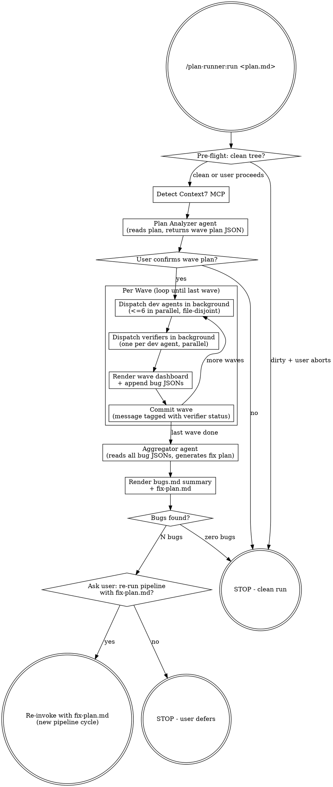

# plan-runner — Design Spec

**Date:** 2026-04-15
**Status:** Design approved, awaiting implementation plan
**Plugin name:** `plan-runner`
**Plugin location:** `plugins/plan-runner/`

## What it is

A Claude Code plugin that takes a free-form Markdown implementation plan and executes it through a parallel agent swarm with built-in verification and bug-driven re-planning. Each cycle: an analyzer agent buckets the plan into waves of file-disjoint tasks, dev agents implement in parallel, verifier agents check each implementation against the plan, an aggregator collects all bugs and generates a fix-plan, and the user decides whether to run the pipeline again with the fix-plan as the new input.

## High-level flow



## Locked-in design decisions

| # | Decision | Rationale |
|---|----------|-----------|
| 1 | Input is **free-form Markdown plan file** (any structure, any source) | User wants to point at any plan they have, not be locked to writing-plans output |
| 2 | **DAG of waves, file-disjoint within wave, max 6 agents per wave** | Respects task ordering AND avoids write conflicts. Wave structure also gives natural status checkpoint |
| 3 | **Per-wave batched verification** (devs all finish -> verifiers all run -> next wave) | Wave is already a sync point. Devs in wave N work against verified code from wave N-1 |
| 4 | **Single working tree, per-wave commits** with verifier-status tag in commit message | File-disjoint constraint already prevents conflicts; worktrees would buy isolation we don't need. Per-wave commits give natural recovery points without per-agent commit noise |
| 5 | **Per-verifier JSON files + aggregator-rendered Markdown summary** | Clean machine input for aggregator (no parsing fragility, no concurrent-write contention) + human-readable output |
| 6 | **Three-layer status reporting**: per-agent return status, per-wave dashboard, Claude Tasks. Agents dispatched with `run_in_background: true` | Layers reinforce each other. Background mode lets orchestrator do bookkeeping (Task updates, next-wave prep) while agents run |
| 7 | **Dedicated `plan-analyzer` agent** (not inline in orchestrator) | Plan analysis is a one-shot reasoning task; isolating it preserves the orchestrator's context for the long coordination loop |
| 8 | **One full pipeline pass, then user-gated re-run with fix-plan.md** as new input. No automatic loop cap. | User decides each cycle. Cycle counter in prompts so user can spot non-convergence |
| 9 | **Context7 MCP detected once at startup**, passed as flag to dev agents only | Verifiers and aggregator review against the plan, not against current docs. Skip Context7 entirely if not detected |

## Plugin layout

```
plugins/plan-runner/
  .claude-plugin/
    plugin.json              # name, version, keywords
  agents/
    plan-analyzer.md         # 1x: parses plan, returns wave plan JSON
    plan-dev.md              # generic dev agent (parameterized per task)
    plan-verifier.md         # generic verifier (parameterized per dev task)
    plan-aggregator.md       # 1x: collects bug JSONs, generates fix plan
  skills/
    run/
      SKILL.md               # orchestrator entry point
  test-fixtures/
    tiny.md
    medium.md
    pathological.md
  README.md
  LICENSE
```

## Agent roster

| Agent | Count per pipeline | Model | Job |
|-------|--------------------|-------|-----|
| `plan-analyzer` | 1 | sonnet | Reads plan.md, returns wave plan JSON: waves, agents-per-wave, file ownership per agent, recommended dev model per task |
| `plan-dev` | up to 6 per wave (variable across waves) | sonnet (default), opus if analyzer flags task as complex | Implements assigned tasks, writes only assigned files, uses Context7 if available |
| `plan-verifier` | one per dev agent that ran | sonnet | Reads dev agent's task spec + the files dev was assigned + the actual diff for those files; reports each acceptance-criteria gap as a bug JSON |
| `plan-aggregator` | 1 per pipeline | sonnet | Reads all bug JSONs, dedups, ranks (P0-P3), produces `bugs.md` summary + `fix-plan.md` (a new plan ready for re-runs) |

Total agents per pipeline: `1 + N(devs) + N(verifiers) + 1` where N(devs) = N(verifiers) = sum across waves, capped at 6 concurrent.

## Why these four agents (and not more)

- **No separate orchestrator agent.** The skill itself is the orchestrator (matches qa-swarm pattern). Skills are the controller, agents are the workers.
- **No separate commit agent.** The orchestrator runs `git add -A && git commit` directly between waves.
- **Dev and verifier are generic, parameterized.** Same definition file, different prompt context per invocation. Avoids agent sprawl.
- **Plan-analyzer and aggregator are distinct** even though both do planning work. Different inputs, outputs, and timing. Forcing them into one would muddle the prompt.

## Output directory

```
docs/plan-runner/{DATE}/{cycle-N}/
  wave-plan.json             # plan-analyzer output (consumed by orchestrator)
  bugs/
    wave-{W}-agent-{A}.json  # one per verifier
  bugs.md                    # human-readable summary (rendered by aggregator)
  fix-plan.md                # next-cycle input (rendered by aggregator)
  manifest.json              # pipeline metadata: input plan, waves, durations, statuses
```

**Cycle numbering:** at startup, orchestrator scans `docs/plan-runner/{DATE}/` for existing `cycle-*` directories and uses the next integer (no existing cycles -> `cycle-1`, `cycle-1` exists -> `cycle-2`, etc). This works for both fresh runs and accepted re-runs without the user needing to specify a cycle number.

## Key file schemas

### `wave-plan.json` (analyzer -> orchestrator)

```json
{
  "source_plan": "docs/foo/feature.md",
  "context7_available": true,
  "waves": [
    {
      "wave_id": 1,
      "rationale": "Foundational schema + types -- nothing depends on prior waves",
      "agents": [
        {
          "agent_id": "wave-1-agent-1",
          "task_title": "Add User and Session DB models",
          "task_excerpt": "verbatim Markdown excerpt from the plan",
          "owned_files": ["src/models/user.ts", "src/models/session.ts"],
          "acceptance_criteria": ["User has email/passwordHash/createdAt", "Session FK to User"],
          "recommended_model": "sonnet",
          "complexity_signals": ["isolated, 2 files, clear spec"]
        }
      ]
    }
  ],
  "uncovered_plan_sections": ["section title or 'none'"]
}
```

`uncovered_plan_sections` lets the analyzer flag any plan content it could not bucket so the orchestrator can warn the user before confirming the wave plan.

### Dev agent return JSON

```json
{
  "agent_id": "wave-1-agent-1",
  "status": "DONE | DONE_WITH_CONCERNS | BLOCKED | NEEDS_CONTEXT",
  "files_written": ["src/models/user.ts", "src/models/session.ts"],
  "files_unexpectedly_modified": [],
  "context7_queries": [{"library": "drizzle-orm", "purpose": "verify pgTable API"}],
  "summary": "two-sentence what-I-did",
  "concerns": ["optional: notes for verifier or user"]
}
```

`files_unexpectedly_modified`: if the dev agent had to touch a file outside `owned_files`, it gets logged here for the verifier to scrutinize.

### Verifier bug JSON (`wave-{W}-agent-{A}.json`)

```json
{
  "agent_id": "wave-1-agent-1",
  "task_title": "Add User and Session DB models",
  "verifier_status": "CLEAN | BUGS_FOUND | UNVERIFIABLE",
  "bugs": [
    {
      "bug_id": "wave-1-agent-1-bug-1",
      "severity": "P0 | P1 | P2 | P3",
      "category": "missing_requirement | incorrect_implementation | scope_drift | broken_existing",
      "title": "Session model missing FK constraint to User",
      "file": "src/models/session.ts",
      "line": 12,
      "evidence": "verbatim code snippet",
      "expected": "FK constraint on userId per acceptance criteria 2",
      "suggested_fix": "Add `references(() => users.id)` to userId column"
    }
  ]
}
```

If `verifier_status: CLEAN`, `bugs: []`. The aggregator only consumes files where bugs exist.

### `bugs.md` (aggregator -> user)

Markdown table grouped by wave then severity, with full bug details below. Same shape as `qa-swarm` report. Purpose: skim-able audit of what went wrong.

### `fix-plan.md` (aggregator -> next pipeline cycle)

A new free-form Markdown plan in the same style as the original input. Each section is a fix task with:
- Title (e.g., "Fix: Session model missing FK constraint")
- File(s) to modify
- Acceptance criteria (the bug's `expected` field becomes the criterion)
- References back to the originating bug ID

Crucially: this file is **valid input to `/plan-runner:run`** itself. The next cycle just feeds it back through the same analyzer -> wave -> verify pipeline.

### `manifest.json` (orchestrator-maintained)

```json
{
  "cycle": 1,
  "input_plan": "docs/foo/feature.md",
  "started_at": "2026-04-15T14:00:00Z",
  "completed_at": "2026-04-15T14:23:11Z",
  "context7_available": true,
  "waves": [
    {
      "wave_id": 1,
      "duration_seconds": 142,
      "agents": [
        { "agent_id": "wave-1-agent-1", "dev_status": "DONE", "verifier_status": "CLEAN", "bug_count": 0 }
      ],
      "commit_sha": "abc123..."
    }
  ],
  "total_bugs": 3,
  "next_cycle_plan": "docs/plan-runner/2026-04-15/cycle-1/fix-plan.md"
}
```

## Data flow summary

```
plan.md
   v (analyzer)
wave-plan.json
   v (orchestrator dispatches per wave)
wave-1: [dev JSON + verifier JSON] x N agents
   v commit wave 1
wave-2: [dev JSON + verifier JSON] x N agents
   v commit wave 2
...
   v (aggregator reads all bug JSONs)
bugs.md + fix-plan.md
   v (user prompt)
   +-- "yes" -> /plan-runner:run docs/.../cycle-1/fix-plan.md  (becomes cycle-2)
   +-- "no"  -> STOP
```

## Error handling

### Pre-flight failures (before any agents dispatch)

| Condition | Behavior |
|---|---|
| Plan file doesn't exist | Print `Error: <path> not found.` Suggest example. STOP. |
| Plan file is empty / no extractable tasks | Run analyzer; if it returns zero waves, print `No actionable tasks found in plan.` STOP. |
| Working tree dirty | Print warning + uncommitted-files list. Prompt `Continue anyway? (Y/n)`. Default n. Same pattern as `qa-swarm:implement`. |
| Context7 not detected | Log `Context7 MCP not detected -- dev agents will rely on training data only.` Continue. |

### Plan-analyzer guardrails

The analyzer's output is untrusted machine input. Orchestrator validates before dispatching anything:

| Validation | Action on failure |
|---|---|
| `waves[*].agents.length <= 6` | Reject. Re-prompt analyzer: "Wave {W} has {N} agents, max is 6. Re-bucket." |
| File ownership disjoint within wave | Reject. Re-prompt with the conflict and: "Tasks {A} and {B} both claim {file}. Re-partition." |
| `uncovered_plan_sections` non-empty | Surface to user during wave-plan confirmation: `Analyzer couldn't bucket: {sections}. Continue / abort / re-analyze?` |
| Analyzer crashes / returns malformed JSON | One retry with explicit "return valid JSON matching this schema". Second failure -> STOP, print analyzer's raw output for debugging. |

### User confirmation gate (after analyzer)

Before dispatching any dev work, orchestrator prints the wave plan for approval:

```
Wave Plan (3 waves, 8 dev agents total)
========================================
Wave 1 (3 agents, ~parallel):
  agent-1: Add User and Session DB models       -> src/models/{user,session}.ts
  agent-2: Add migration runner                  -> src/db/migrate.ts
  agent-3: Define auth types                     -> src/types/auth.ts
Wave 2 (4 agents, ~parallel):
  ...
Wave 3 (1 agent):
  ...

Uncovered plan sections: none
Proceed? (Y/n)
```

If `n`, STOP. If `Y`, begin Wave 1.

### In-flight failures (during a wave)

| Status returned by dev agent | Orchestrator response |
|---|---|
| `DONE` | Proceed to verifier. |
| `DONE_WITH_CONCERNS` | Pass concerns to verifier as extra inspection focus. Proceed. |
| `NEEDS_CONTEXT` | Treat as a bug: synthesize a P1 bug entry ("dev agent blocked: needed X"), continue with whatever was written, let aggregator queue it for cycle 2. |
| `BLOCKED` (couldn't start) | Synthesize a P0 bug entry, mark dashboard cell `BLOCKED`, continue wave. Don't retry inline -- the aggregator's fix-plan will address it next cycle. |
| Tool error / agent crash | Log to `manifest.json`. Treat the same as BLOCKED. Continue wave. |
| Dev agent wrote to files outside `owned_files` | Verifier inspects them with extra scrutiny; aggregator flags as `category: scope_drift`. |

| Status returned by verifier | Orchestrator response |
|---|---|
| `CLEAN` | Bug JSON has empty `bugs[]`, dashboard shows clean. |
| `BUGS_FOUND` | Write bug JSON to `bugs/wave-W-agent-A.json`. Dashboard shows bug count. |
| `UNVERIFIABLE` (e.g., couldn't read files) | Synthesize a P2 bug "verification failed: {reason}". Continue. |
| Verifier crash | Synthesize a P2 bug "verifier crashed". Continue. |

**Key principle: no inline retries within a pipeline run.** Bugs are aggregated, fix-plan is generated, user decides whether to start cycle 2. Don't burn the user's time looping mid-pipeline.

### Wave commit failures

| Condition | Behavior |
|---|---|
| Nothing to commit (all dev agents BLOCKED) | Skip commit. Note in `manifest.json`: `"commit_sha": null, "skipped_reason": "no changes"`. Continue. |
| Pre-commit hook fails | Print hook output. Prompt `Continue without committing this wave? (Y/n)`. If Y, leave wave uncommitted, continue (subsequent wave commits will include it). If n, STOP. |
| Other git failure | Print error. STOP. |

### End-of-pipeline edge cases

| Condition | Behavior |
|---|---|
| Zero bugs found across all waves | Print success summary. Skip aggregator. Skip the re-run prompt. STOP. |
| Aggregator crashes | Bug JSONs are intact on disk. Print `Aggregator failed -- bug JSONs saved at {path}, run aggregation manually.` STOP. |
| All bugs are P3 only | Aggregator generates fix-plan, user prompt adds a hint: `(All N bugs are P3 / low priority -- re-running is optional.)` |
| User declines re-run | Print `Stopping. Bugs and fix-plan saved at {path}. Re-run later with /plan-runner:run {fix-plan path}.` |
| User accepts re-run | Auto-handoff to a fresh-context subagent that invokes `/plan-runner:run {fix-plan path}`. Same pattern as `qa-swarm:attack` Step 6 -- preserves user attention without polluting the orchestrator's context with a second cycle's state. |

### Re-run convergence (no hard cap)

No automatic cap on cycles. User decides each time. Two safety nets so we don't silently spin:

1. **Cycle counter visible.** Prompt at end of cycle 2 includes: `(This was cycle 2. Cycle 1 had X bugs, this cycle has Y.)` -- user can see if it's converging or oscillating.
2. **Per-cycle output is cumulative.** `cycle-1/`, `cycle-2/`, `cycle-3/` directories preserve full history. User can diff bugs.md across cycles to spot recurring failures.

If user wants automation, they can wrap `/plan-runner:run` in `/loop`. We don't bake a cap into the plugin.

### Mid-pipeline interruption (Ctrl-C / session ends)

- Bug JSONs and `manifest.json` are written incrementally as each wave completes -- partial state survives.
- Per-wave commits preserve completed work in git.
- No resume-from-partial-state command in v1 (YAGNI). User re-runs from start with the same plan; analyzer re-buckets and re-dispatches. Already-committed work is just re-touched (or not, if the dev agent finds no diff to make).

## Testing & validation strategy

This is a metadata-driven plugin (Markdown agent definitions + JSON contracts + a skill that orchestrates LLM calls). There is no compiled code or unit-testable logic. "Testing" here means three things:

### 1. Static validation (cheap, automatable)

| What | How |
|---|---|
| Plugin manifest valid | Match Claude Code plugin schema. Verify `plugin.json` keys, agent files exist where referenced, skill `SKILL.md` has required frontmatter. |
| JSON schemas for agent outputs | Write JSON Schema files for `wave-plan.json`, dev return JSON, verifier bug JSON, `manifest.json`. Orchestrator validates analyzer output before dispatching. |
| Markdown agent files have required frontmatter | Each agent has `name`, `description`, `model`, `color`. Sanity-check during plugin install. |

### 2. Reference plans (manual smoke tests)

Ship 2-3 reference plans in `plugins/plan-runner/test-fixtures/` for manual verification:

| Fixture | Purpose | Expected wave shape |
|---|---|---|
| `tiny.md` -- single isolated task | Verify minimal path (1 wave, 1 dev, 1 verifier, no bugs) | 1 wave x 1 agent |
| `medium.md` -- 5 tasks, some sequential, some parallel | Verify analyzer correctly identifies the DAG and bucketing | 2-3 waves x 2-4 agents |
| `pathological.md` -- 10 tasks where 8 touch the same core file | Verify file-disjoint constraint forces sequential waves rather than parallel | 5+ waves x 1-2 agents |

These are inspection harnesses, not automated tests. Run the plugin on a fixture, eyeball the wave-plan, run the pipeline against a throwaway repo, inspect the bug JSONs and rendered Markdown.

### 3. Behavioral assertions (covered by orchestrator's own validation)

Because the orchestrator validates analyzer output against schema and against the disjoint-files invariant before dispatching, several "tests" are baked into runtime:

- Cannot dispatch a wave with >6 agents (validation rejects, re-prompts analyzer).
- Cannot dispatch a wave with overlapping file ownership (same).
- Cannot proceed to wave N+1 with unverified wave N (sequential structure forces it).
- Cannot skip the user-confirmation gate (orchestrator blocks on input).

These are structural guarantees, not test assertions, but they cover the failure modes that would matter most.

### What we are explicitly NOT testing

- **Agent prompt quality.** Whether the dev agent writes good code or the verifier catches real bugs is judged by running the plugin on real plans, not by automated tests. Like all LLM-driven tooling, this is operator-validated, not unit-tested.
- **End-to-end automation.** We are not setting up a CI harness that runs full pipelines on fixture repos. The reference plans above are for the maintainer to spot-check, not for CI.

## Out of scope for v1

- Resume-from-partial-state command
- Multi-repo / monorepo task fanout
- Replacing the analyzer's wave plan via user edit before confirmation (right now: accept or abort; could add "edit" later)
- Cycle convergence detection (e.g., warn if same bug reappears across cycles)
- Worktree-based isolation (file-disjoint constraint within waves makes this unnecessary at v1 scope)

## Marketplace registration

After implementation, add to `.claude-plugin/marketplace.json`:

```json
{
  "name": "plan-runner",
  "source": "./plugins/plan-runner",
  "category": "development"
}
```

And follow versioning convention: tag releases as `plan-runner/v<version>`.
